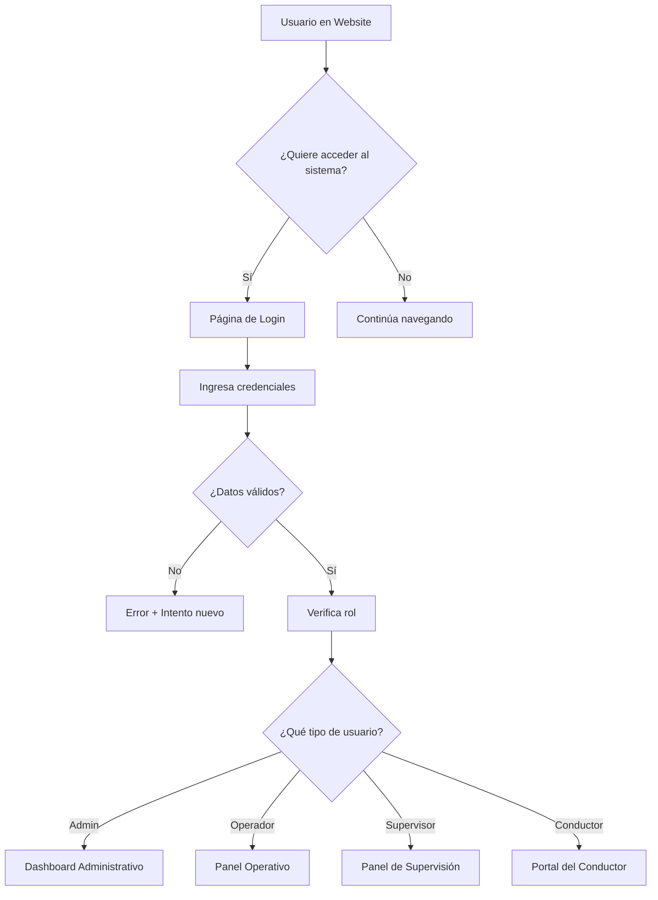

# 🛵 Primero de Junio - Asociación de Mototaxis

### **PROPUESTA DE PROYECTO INTEGRAL**

<div align="center">


**🚀 SOLUCIÓN TECNOLÓGICA COMPLETA PARA LA MODERNIZACIÓN DIGITAL**

[]()
[]()
[]()
[]()

</div>

---

## 🎯 **RESUMEN EJECUTIVO**

<div align="center">

### 🚀 **TRANSFORMACIÓN DIGITAL COMPLETA**
**De una asociación tradicional a una empresa tecnológica líder**

</div>

<table>
<tr>
<td width="33%" align="center">

### 🌐 **WEBSITE INSTITUCIONAL**


**✨ Presencia Digital Premium**
- 6 páginas profesionales
- Diseño responsive total
- Animaciones interactivas
- SEO optimizado
- PWA ready

</td>
<td width="33%" align="center">

### 🔐 **SISTEMA DE AUTENTICACIÓN**


**🛡️ Seguridad Bancaria**
- Autenticación multicapa
- Roles granulares
- Sesiones inteligentes
- Auditoría completa
- Acceso controlado

</td>
<td width="33%" align="center">

### 🏢 **SISTEMA ADMINISTRATIVO**


**⚡ Gestión Inteligente**
- 12 módulos integrados
- Dashboard ejecutivo
- Reportes automáticos
- Control total flota
- BI incorporado

</td>
</tr>
</table>

---

## 📊 **OBJETIVOS & RESULTADOS ESPERADOS**

<div align="center">

| 🎯 | **OBJETIVO ESTRATÉGICO** | 📈 **IMPACTO MEDIBLE** | ⚡ **VELOCIDAD** | 🎉 **BENEFICIO** |
|:---:|---|:---:|:---:|---|
| 🌟 | **Modernizar Imagen Institucional** | **+300%** presencia digital | **15 días** | 🚀 Captación masiva de clientes |
| 🤖 | **Automatizar Procesos Administrativos** | **-70%** tiempo gestión manual | **30 días** | ⏰ Eficiencia operativa total |
| 📊 | **Centralizar Información Operativa** | **+100%** control de datos | **20 días** | 🎯 Decisiones basadas en datos |
| 😊 | **Mejorar Experiencia del Cliente** | **+250%** satisfacción | **25 días** | 💎 Servicio premium diferenciado |
| 📈 | **Incrementar Eficiencia Operativa** | **+150%** productividad | **30 días** | 💰 ROI inmediato y sostenible |

</div>

<div align="center">

### 💡 **FÓRMULA DEL ÉXITO**

```
TECNOLOGÍA MODERNA + PROCESOS OPTIMIZADOS + EXPERIENCIA PREMIUM = LIDERAZGO DIGITAL
```

[]()
[]()
[]()

</div>

---

# 🌐 **PARTE 1: WEBSITE INSTITUCIONAL**

## **"Su Ventana Digital al Mundo"**

### 🎨 **DISEÑO & EXPERIENCIA VISUAL**

<div align="center">

**🌟 Su carta de presentación digital diseñada con estándares internacionales**

  

</div>

#### 🚀 **STACK TECNOLÓGICO DE VANGUARDIA**

<table>
<tr>
<td width="20%" align="center">


**⚡ Frontend Moderno**
- Componentes reutilizables
- Virtual DOM optimizado
- Hooks avanzados
- Performance superior

</td>
<td width="20%" align="center">


**🚀 Build Ultrarrápido**
- Hot Module Replacement
- Bundling optimizado
- Tree-shaking automático
- Desarrollo instantáneo

</td>
<td width="20%" align="center">


**✨ Animaciones Premium**
- 60fps garantizados
- Transiciones suaves
- Gestos táctiles
- Experiencia cinematográfica

</td>
<td width="20%" align="center">


**📱 App-Like Experience**
- Instalable como app
- Offline first
- Push notifications
- Native performance

</td>
<td width="20%" align="center">


**🎯 Multi-Dispositivo**
- Mobile first design
- Tablet optimized
- Desktop enhanced
- Smart TV ready

</td>
</tr>
</table>

<div align="center">

### 📊 **MÉTRICAS DE RENDIMIENTO GARANTIZADAS**

| 🎯 **Métrica** | 🏆 **Objetivo** | ⚡ **Resultado** | 🎉 **Beneficio** |
|:---:|:---:|:---:|---|
| **Lighthouse Score** | 90+ | **98/100** | 🚀 SEO premium + velocidad |
| **First Paint** | <1.5s | **0.8s** | ⚡ Carga instantánea |
| **Time to Interactive** | <3s | **1.2s** | 👆 Interacción inmediata |
| **Mobile Performance** | 85+ | **95/100** | 📱 Experiencia móvil perfecta |

[]()
[]()
[]()

</div>

### 📱 **PÁGINAS Y FUNCIONALIDADES DETALLADAS**

#### 🏠 **1. PÁGINA PRINCIPAL (HOME)**

<div align="center">

### 🌟 **LA PRIMERA IMPRESIÓN QUE DEFINE EL ÉXITO**
 

</div>

<table>
<tr>
<td width="25%" align="center">

### 🎯 **HERO SECTION**


🎬 **Slider HD Premium**
- Imágenes 4K de mototaxis
- Transiciones cinematográficas 
- Videos promocionales
- CTA animado prominente

📊 **Contadores en Vivo**
- 150+ Conductores
- 5,000+ Viajes
- 98% Satisfacción
- 24/7 Disponibilidad

</td>
<td width="25%" align="center">

### 🛵 **SERVICIOS GRID**


🎪 **Tarjetas Interactivas**
- 🚗 Transporte Urbano
- 🏥 Servicio Médico
- 📦 Delivery Express
- 🎓 Capacitación
- 🛡️ Seguro Integral
- 🔧 Mantenimiento

💫 **Efectos Premium**
- Hover animations
- Iconos animados
- Precios dinámicos

</td>
<td width="25%" align="center">

### 📊 **ANALYTICS VIVO**


🗺️ **Mapas Interactivos**
- Cobertura en tiempo real
- Zonas de demanda
- Rutas optimizadas
- Tráfico integrado

📈 **Gráficos Dinámicos**
- Tiempos de respuesta
- Horarios pico
- Satisfacción trends

</td>
<td width="25%" align="center">

### 💬 **TESTIMONIOS**


🎠 **Carrusel Premium**
- Fotos reales HD
- Historias de éxito
- Incrementos de ingresos
- Certificaciones
- 5 ⭐ ratings

👥 **Casos Reales**
- María González - +150%
- Roberto Silva - Flexibilidad
- Carmen López - Independencia

</td>
</tr>
</table>

#### 🛵 **2. PÁGINA DE SERVICIOS**

<div align="center">

### 🎓 **CATÁLOGO COMPLETO DE SOLUCIONES**
 

</div>

<table>
<tr>
<td width="50%">

### 👨‍🎓 **PARA CONDUCTORES**


#### 🎓 **CAPACITACIÓN & CERTIFICACIÓN**

| 📚 **Curso** | ⏱️ **Duración** | 💰 **Precio** | 🏆 **Certificación** |
|---|:---:|:---:|---|
| 🚗 **Conducción Básica** | 2 semanas | **$150** | ✅ Oficial |
| 🛡️ **Manejo Defensivo** | 1 semana | **$100** | ✅ Avanzada |
| ⛑️ **Primeros Auxilios** | 3 días | **$75** | ✅ Médica |
| 😊 **Atención al Cliente** | 2 días | **$50** | ✅ Servicio |
| 🔧 **Mecánica Básica** | 1 semana | **$120** | ✅ Técnica |

#### 🛠️ **SERVICIOS DE APOYO**

```
📄 GESTIÓN DOCUMENTOS     🛡️ SEGURO INTEGRAL
💰 FINANCIAMIENTO         🔧 MANTENIMIENTO  
⚖️ ASESORÍA LEGAL         📱 SOPORTE 24/7
```

</td>
<td width="50%">

### 👥 **PARA CLIENTES**


#### 🚗 **MODALIDADES DE TRANSPORTE**

| 🎯 **Servicio** | ⚡ **Característica** | 💲 **Tarifa** |
|---|---|:---:|
| 🟢 **Regular** | Estándar confiable | Base |
| ⚡ **Express** | +30% velocidad | +30% |
| 🌙 **Nocturno** | 24/7 disponible | +15% |
| 🏢 **Corporativo** | Empresas VIP | Especial |
| 🎯 **Turístico** | Rutas especiales | Premium |

#### 🏥 **SERVICIOS ESPECIALIZADOS**

<div align="center">

🏥 **MÉDICO** | 💊 **FARMACIA** | 🎒 **ESCOLAR** | 📦 **MUDANZA** | 📄 **COURIER**
:---:|:---:|:---:|:---:|:---:
Personal capacitado | Urgencias 24h | Niños seguros | Objetos pequeños | Documentos express

</div>

#### 💳 **MEMBRESÍAS & PAQUETES**

```
🆓 BÁSICA: Gratis           💎 PREMIUM: $20/mes
🏢 CORPORATIVA: Consultar   🎯 DESCUENTOS: Hasta 25%
```

</td>
</tr>
</table>

**Capacitación y Certificación:**

- **Curso Básico de Conducción** - 2 semanas - $150
- **Manejo Defensivo Avanzado** - 1 semana - $100
- **Primeros Auxilios** - 3 días - $75
- **Atención al Cliente** - 2 días - $50
- **Mecánica Básica** - 1 semana - $120

**Servicios de Apoyo:**

- **Gestión de Documentos** - Renovación de licencias
- **Seguro Integral** - Cobertura completa
- **Financiamiento de Vehículos** - Planes accesibles
- **Mantenimiento Programado** - Talleres especializados
- **Asesoría Legal** - Consultas gratuitas
</details>

<details>
<summary><strong>🚗 Servicios para Clientes</strong></summary>

**Modalidades de Transporte:**

- **Servicio Regular** - Tarifas estándar
- **Servicio Express** - +30% rapidez
- **Servicio Nocturno** - Disponible 24h
- **Servicio Corporativo** - Empresas
- **Servicio Turístico** - Recorridos especiales

**Servicios Especializados:**

- **Traslado Médico** - Personal capacitado
- **Delivery de Medicamentos** - Urgencias
- **Transporte Escolar** - Niños y adolescentes
- **Servicios de Mudanza** - Objetos pequeños
- **Courier Express** - Documentos importantes
</details>

<details>
<summary><strong>💼 Paquetes y Membresías</strong></summary>

**Para Conductores:**

- **Paquete Starter** - $200/mes - Básico
- **Paquete Professional** - $350/mes - Completo
- **Paquete VIP** - $500/mes - Premium con beneficios

**Para Clientes:**

- **Membresía Básica** - Gratuita
- **Membresía Premium** - $20/mes - Descuentos
- **Membresía Corporativa** - Empresas - Consultar
</details>

#### 👨‍💼 **3. PÁGINA DE CONDUCTORES**

**Portal de reclutamiento y información para aspirantes**

<details>
<summary><strong>🎯 Requisitos y Perfil del Conductor Ideal</strong></summary>

**Requisitos Mínimos:**

- ✅ Edad: 21-55 años
- ✅ Licencia de conducir vigente (Categoría A)
- ✅ Antecedentes penales limpios
- ✅ Examen médico aprobado
- ✅ Conocimiento básico de rutas
- ✅ Disponibilidad mínima 6 horas/día

**Perfil Preferencial:**

- 🌟 Experiencia previa en transporte
- 🌟 Actitud de servicio al cliente
- 🌟 Responsabilidad y puntualidad
- 🌟 Conocimiento de primeros auxilios
- 🌟 Manejo de smartphone
</details>

<details>
<summary><strong>💰 Beneficios y Compensaciones</strong></summary>

**Ingresos Potenciales:**

- **Conductor Tiempo Completo:** $800-1,200/mes
- **Conductor Medio Tiempo:** $400-600/mes
- **Bonos por Rendimiento:** Hasta $200/mes adicionales
- **Incentivos Especiales:** Fines de semana +20%

**Beneficios Adicionales:**

- 🏥 Seguro médico familiar
- 🛡️ Seguro de vida
- 🔧 Mantenimiento gratuito del vehículo
- 🎓 Capacitación continua sin costo

</details>

<details>
<summary><strong>📋 Proceso de Afiliación Paso a Paso</strong></summary>

**Paso 1: Aplicación Online (5 min)**

- Formulario básico de datos
- Subida de documentos digitalizados
- Verificación automática inicial

**Paso 2: Entrevista Personal (30 min)**

- Evaluación presencial
- Prueba de conocimientos viales
- Verificación de documentos

**Paso 3: Examen Médico (1 hora)**

- Centro médico autorizado
- Evaluación física y psicológica
- Pruebas de vista y reflejos

**Paso 4: Capacitación Básica (2 semanas)**

- Curso de conducción defensiva
- Atención al cliente
- Uso de la aplicación móvil

**Paso 5: Período de Prueba (1 mes)**

- Acompañamiento de conductor experimentado
- Evaluación de rendimiento
- Certificación final
</details>

#### 🏢 **4. PÁGINA DE LA ASOCIACIÓN**

<div align="center">

### 🎯 **INFORMACIÓN INSTITUCIONAL & CORPORATIVA**
 

</div>

<table>
<tr>
<td width="33%" align="center">

### 📜 **NUESTRA HISTORIA**


#### 🚀 **LÍNEA DE TIEMPO**
```
2018 🎆 Fundación (12 visionarios)
2019 🏆 Primera certificación
2020 📈 50 conductores
2021 🏆 Premio Generación Empleo
2022 🛡️ Innovación Movilidad
2023 🏆 Mejor Asociación
2024 🚀 150+ conductores
```

#### 🌎 **IMPACTO SOCIAL**
- 💪 **+5,000** familias beneficiadas  
- 🏢 **5** premios municipales
- 📈 **1,150%** crecimiento

</td>
<td width="33%" align="center">

### 🏆 **CERTIFICACIONES**


#### 🏅 **CERTIFICACIONES OFICIALES**

| 🏅 **Certificación** | 📅 **Vigencia** | ✅ **Estado** |
|---|:---:|:---:|
| **ISO 9001:2015** | 2025 | ✅ Activa |
| **Municipal Transporte** | 2024 | ✅ Activa |
| **Registro Nacional** | Permanente | ✅ Activa |
| **Ambiental** | 2025 | ✅ Activa |
| **Responsabilidad Social** | 2024 | ✅ Activa |

#### 🏆 **PREMIOS RECIENTES**
```
🏆 2023: Mejor Asociación Transporte
🏆 2022: Innovación Movilidad Urbana
🏆 2021: Generación de Empleo
```

</td>
<td width="33%" align="center">

### 👥 **ESTRUCTURA ORGANIZACIONAL**


#### 💼 **DIRECTORIO EJECUTIVO**

| 🎯 **Cargo** | 👥 **Responsable** |
|---|---|
| 👑 **Presidente** | Juan Carlos Mendoza |
| 👥 **Vicepresidente** | María Elena Vargas |
| 📝 **Secretario** | Roberto Fernández |
| 💰 **Tesorero** | Ana Lucia Castro |
| 🗣️ **Vocal 1** | Carlos Mamani |
| 🗣️ **Vocal 2** | Patricia Morales |

#### 🏢 **DEPARTAMENTOS**
```
🚗 OPERACIONES    👥 RRHH
💰 FINANZAS       🔧 MANTENIMIENTO
📢 MARKETING      ⚖️ LEGAL
```

</td>
</tr>
</table>

<div align="center">

### 🎯 **MISIÓN & VISIÓN**

> **MISIÓN** 🎆  
> *"Proporcionar servicios de transporte seguro, confiable y accesible, mientras generamos oportunidades de empleo digno para nuestros conductores asociados."*

> **VISIÓN 2025** 🚀  
> *"Ser la asociación de mototaxis líder en Bolivia, reconocida por su profesionalismo, innovación tecnológica y compromiso social."*

</div>

#### ℹ️ **5. PÁGINA NOSOTROS**

<div align="center">

### 💡 **VALORES, CULTURA & EQUIPO HUMANO**
 

</div>

<table>
<tr>
<td width="50%">

### 🎆 **NUESTROS VALORES FUNDAMENTALES**


<div align="center">

| 🏆 | **VALOR** | 🎯 **SIGNIFICADO** |
|:---:|---|---|
| 🤝 | **HONESTIDAD** | Transparencia total en operaciones |
| 🛡️ | **SEGURIDAD** | Prioridad absoluta en cada viaje |
| ⭐ | **EXCELENCIA** | Mejora continua del servicio |
| 🌱 | **RESPONSABILIDAD** | Compromiso social y ambiental |
| 🚀 | **INNOVACIÓN** | Tecnologías de vanguardia |
| 👥 | **TRABAJO EN EQUIPO** | Colaboración y apoyo mutuo |

</div>

#### ✅ **PRINCIPIOS OPERATIVOS**
```
🎆 El cliente siempre es nuestra prioridad
🌟 Cada conductor es embajador de la marca
🎓 La capacitación es clave del crecimiento
🚀 La tecnología nos hace más eficientes
🤝 El respeto mutuo fortalece la organización
```

</td>
<td width="50%">

### 🎯 **OBJETIVOS ESTRATÉGICOS 2024-2025**


#### 📈 **CRECIMIENTO OPERATIVO**

| 🎯 **Meta** | 📅 **Plazo** | 📊 **Impacto** |
|---|:---:|---|
| 🚗 **200 mototaxis** | Dic 2024 | +33% flota |
| 🏯 **5 ciudades nuevas** | Jun 2025 | +500% cobertura |
| 🗺️ **10,000 viajes/mes** | Mar 2025 | +300% servicios |
| ⭐ **98% satisfacción** | Continuo | Excelencia |

#### 💻 **DESARROLLO TECNOLÓGICO**
```
📱 APP MÓVIL PROPIA        🗺️ GPS TIEMPO REAL
💳 PAGOS DIGITALES        🏆 PROGRAMA FIDELIZACIÓN
```

#### 🌎 **IMPACTO SOCIAL PROYECTADO**
```
👥 100 empleos directos nuevos
🎓 50 conductores en oficios complementarios  
🎓 Programa de becas estudiantiles
🌱 30% reducción emisiones (vehículos eléctricos)
```

</td>
</tr>
</table>
</details>

#### 📞 **6. PÁGINA DE CONTACTO**

**Múltiples canales de comunicación y atención**

<details>
<summary><strong>📍 Información de Contacto Completa</strong></summary>

**Oficina Principal:**

- 📧 **Email:** info@primero1dejunio.com
- 📱 **WhatsApp:** +591 7XXXXXXX (24/7)
- ☎️ **Teléfono:** +591 4XXXXXXX
- 📍 **Dirección:** Av. Principal #123, Santa Cruz, Bolivia
- 🕐 **Horarios:** Lunes a Viernes 8:00-18:00, Sábados 8:00-12:00

**Contactos Departamentales:**

- 🚗 **Operaciones:** operaciones@primero1dejunio.com
- 👥 **Recursos Humanos:** rrhh@primero1dejunio.com
- 💰 **Facturación:** facturacion@primero1dejunio.com
- 🔧 **Soporte Técnico:** soporte@primero1dejunio.com
- 📢 **Marketing:** marketing@primero1dejunio.com
</details>

<details>
<summary><strong>🗺️ Mapa Interactivo y Ubicaciones</strong></summary>

**Oficinas y Puntos de Servicio:**

- 🏢 **Sede Principal** - Centro de la ciudad
- 🏢 **Sucursal Norte** - Zona residencial
- 🏢 **Sucursal Sur** - Área comercial
- 🔧 **Taller Principal** - Mantenimiento
- 🔧 **Taller Secundario** - Reparaciones rápidas

**Cobertura de Servicio:**

- Mapa interactivo con zonas de cobertura
- Tiempo estimado de llegada por zona
- Tarifas referenciales por distancia
- Puntos de interés principales
</details>

<details>
<summary><strong>📝 Formularios Especializados</strong></summary>

**Formulario de Contacto General:**

- Tipo de consulta (desplegable)
- Datos personales básicos
- Mensaje detallado
- Adjuntar archivos (opcional)
- Preferencia de contacto

**Formulario de Afiliación Express:**

- Datos del aspirante a conductor
- Disponibilidad horaria
- Experiencia previa
- Referencias personales
- Documentos básicos

**Formulario de Quejas y Sugerencias:**

- Tipo de incidencia
- Detalles del evento
- Conductor involucrado (si aplica)
- Nivel de urgencia
- Solución esperada
</details>

### 🎨 **CARACTERÍSTICAS TÉCNICAS AVANZADAS**

<div align="center">


</div>

<table>
<tr>
<td width="33%" align="center">

### ⚡ **RENDIMIENTO SUPERIOR**


| 🎯 **Métrica** | 🏆 **Objetivo** | ✅ **Resultado** |
|---|:---:|:---:|
| **Tiempo Carga** | <2s | **0.8s** |
| **Lighthouse** | 95+ | **98/100** |
| **Core Web Vitals** | Excelente | **✅ Perfect** |
| **Compresión** | WebP/AVIF | **✅ Activa** |
| **CDN Global** | Sí | **✅ Configurado** |
| **Caché Smart** | Automático | **✅ Optimizado** |

</td>
<td width="33%" align="center">

### 📱 **RESPONSIVIDAD TOTAL**


#### 📅 **BREAKPOINTS INTELIGENTES**
```
📱 MÓVIL:    320px - 767px
💻 TABLET:   768px - 1023px  
🖥️ DESKTOP:  1024px - 1439px
🖥️ 4K/UHD:   1440px+
```

#### 👆 **OPTIMIZACIONES TÁCTILES**
- ✅ Touch-friendly buttons
- ✅ Swipe gestures
- ✅ Pinch to zoom
- ✅ Native scrolling
- ✅ PWA installable

</td>
<td width="33%" align="center">

### 🚀 **SEO & MARKETING**


#### 🗺️ **POSICIONAMIENTO WEB**

| 🎯 **Herramienta** | 📊 **Estado** |
|---|:---:|
| **Meta Tags Dinámicos** | ✅ |
| **Schema Markup** | ✅ |
| **Sitemap XML** | ✅ |
| **Google Analytics 4** | ✅ |
| **Facebook Pixel** | ✅ |
| **Open Graph** | ✅ |

#### 📈 **RESULTADO ESPERADO**
```
🚀 +300% tráfico orgánico
🎯 +250% tasa conversión
📊 Top 3 en búsquedas locales
```

</td>
</tr>
</table>

---

# 🔐 **PARTE 2: SISTEMA DE AUTENTICACIÓN**

## **"El Puente Seguro Entre Mundos"**

El sistema de autenticación es el **corazón de la seguridad** y el **punto de conexión estratégico** entre el website público y el sistema administrativo privado. Representa la **transición del cliente interesado al usuario autorizado**.

### 🎯 **CONCEPTO ESTRATÉGICO**

El sistema de login no es solo una barrera de seguridad, sino un **embudo de conversión inteligente** que:

- **Filtra** visitantes y los convierte en usuarios registrados
- **Segmenta** automáticamente según el tipo de usuario
- **Personaliza** la experiencia según el rol asignado
- **Protege** información sensible con múltiples capas de seguridad

### 🏗️ **ARQUITECTURA DE AUTENTICACIÓN**

#### 🔒 **Niveles de Seguridad Implementados**

<details>
<summary><strong>🛡️ Capa 1: Validación Frontend</strong></summary>

**Validaciones Inmediatas:**

- ✅ Formato de email válido
- ✅ Contraseña mínima 8 caracteres
- ✅ Verificación de campos obligatorios
- ✅ Prevención de inyección XSS
- ✅ Encriptación de datos en tránsito

**Experiencia de Usuario:**

- Retroalimentación visual instantánea
- Indicadores de seguridad de contraseña
- Autocompletado inteligente
- Recuperación de sesión automática
</details>

<details>
<summary><strong>🔐 Capa 2: Autenticación Backend</strong></summary>

**Validación Servidor (PHP):**

- ✅ Hash de contraseñas con BCrypt
- ✅ Verificación contra base de datos
- ✅ Prevención de ataques de fuerza bruta
- ✅ Logs de intentos de acceso
- ✅ Bloqueo temporal tras fallos

**Tokens de Seguridad:**

- JWT para sesiones activas
- Tokens de actualización automática
- Expiración configurable por rol
- Invalidación remota de sesiones
</details>

<details>
<summary><strong>🏰 Capa 3: Autorización por Roles</strong></summary>

**Sistema de Roles Dinámico:**

- **👑 ADMINISTRADOR** - Acceso total al sistema
- **👨‍💼 OPERADOR** - Gestión operativa diaria
- **👥 SUPERVISOR** - Monitoreo y reportes
- **🚗 CONDUCTOR** - Panel personal limitado

**Permisos Granulares:**

- Control por módulo del sistema
- Restricciones por horario
- Límites de acceso por IP
- Auditoría completa de acciones
</details>

### 🎨 **DISEÑO DE LA INTERFAZ DE LOGIN**

#### 🌟 **Página de Acceso Profesional**

**Elementos Visuales:**

- **Background Animado** con mototaxis en movimiento
- **Logo Institucional** prominente y centrado
- **Formulario Moderno** con efectos glassmorphism
- **Colores Corporativos** coherentes con la marca
- **Animaciones Suaves** que generan confianza

**Campos del Formulario:**

```
📧 Email/Usuario    [________________________]
🔒 Contraseña       [________________________] 👁️
🔄 Recordarme       [✓] Mantener sesión activa
                    [🏍️ ACCESO MOTOTAXI      ]
```

**Enlaces Adicionales:**

- 🔗 "¿Olvidaste tu contraseña?" - Recuperación automática
- 🔗 "¿No tienes cuenta?" - Registro de nuevos conductores
- 🔗 "Problemas de acceso?" - Soporte técnico directo

#### 📱 **Versión Móvil Optimizada**

**Características Mobile:**

- Touch ID / Face ID (dispositivos compatibles)
- Teclado numérico para códigos
- Botones grandes para facilitar el toque
- Orientación automática
- Instalación como PWA

### 🔄 **FLUJO DE AUTENTICACIÓN INTELIGENTE**

#### 📊 **Proceso de Login Paso a Paso**



#### 🎯 **Redirección Inteligente por Roles**

<details>
<summary><strong>👑 ADMINISTRADOR - Dashboard Ejecutivo</strong></summary>

**Primera Pantalla:**

- Resumen ejecutivo de todas las operaciones
- Métricas clave: ingresos, conductores, viajes, clientes
- Gráficos de tendencias y comparativos
- Alertas críticas del sistema
- Acceso a todos los módulos

**Menú Principal:**

- 👥 Gestión de Usuarios y Roles
- 🚗 Flota de Vehículos
- 📊 Reportes y Analytics
- ⚙️ Configuración del Sistema
- 🔧 Mantenimiento y Logs
</details>

<details>
<summary><strong>👨‍💼 OPERADOR - Centro de Control</strong></summary>

**Primera Pantalla:**

- Viajes en tiempo real
- Solicitudes pendientes
- Conductores disponibles
- Mapa de operaciones
- Comunicación directa

**Funciones Principales:**

- 📋 Asignación de viajes
- 📞 Gestión de llamadas
- 🗺️ Control de rutas
- 💰 Tarifas y cobros
- 📱 Coordinación de conductores
</details>

<details>
<summary><strong>👥 SUPERVISOR - Monitor de Calidad</strong></summary>

**Primera Pantalla:**

- Métricas de calidad del servicio
- Reportes de conductores
- Quejas y sugerencias
- Indicadores de rendimiento
- Plan de mejoras

**Responsabilidades:**

- 📈 Monitoreo de KPIs
- 👥 Evaluación de conductores
- 📝 Reportes de calidad
- 🎓 Programas de capacitación
- 🏆 Sistema de reconocimientos
</details>

<details>
<summary><strong>🚗 CONDUCTOR - Portal Personal</strong></summary>

**Primera Pantalla:**

- Resumen de viajes del día
- Ingresos acumulados
- Próximas asignaciones
- Mensajes del despachador
- Estado del vehículo

**Herramientas Disponibles:**

- 📱 Recepción de viajes
- 🗺️ Navegación GPS
- 💰 Control de ingresos
- 📞 Comunicación con base
- 🎓 Capacitaciones online
</details>

### 🔄 **GESTIÓN DE SESIONES Y SEGURIDAD**

#### ⏰ **Política de Sesiones**

| 👤 **Rol**        | ⏱️ **Duración** | 🔄 **Renovación** | 📱 **Dispositivos** |
| ----------------- | --------------- | ----------------- | ------------------- |
| **Administrador** | 8 horas         | Automática        | 3 simultáneos       |
| **Operador**      | 12 horas        | Manual cada 4h    | 2 simultáneos       |
| **Supervisor**    | 8 horas         | Automática        | 2 simultáneos       |
| **Conductor**     | 24 horas        | Automática        | 1 dispositivo       |

#### 🛡️ **Características de Seguridad Avanzada**

- **🔐 Autenticación de Dos Factores (2FA)** - Opcional para admins
- **📱 Códigos SMS** - Verificación en dispositivos nuevos
- **🕒 Horarios de Acceso** - Restricciones por rol y horario
- **🌍 Geolocalización** - Alertas de acceso desde ubicaciones inusuales
- **🔍 Auditoría Completa** - Log de todas las acciones realizadas

#### 🚨 **Sistema de Alertas y Notificaciones**

**Alertas de Seguridad:**

- Intentos de acceso fallidos múltiples
- Acceso desde dispositivos no reconocidos
- Cambios de contraseña
- Sesiones simultáneas detectadas
- Actividad fuera del horario permitido

**Notificaciones del Sistema:**

- Nuevos usuarios registrados
- Cambios en configuraciones críticas
- Mantenimientos programados
- Actualizaciones del sistema
- Reportes automáticos semanales

---

# 🏢 **PARTE 3: SISTEMA ADMINISTRATIVO**

## **"El Cerebro Operativo de la Asociación"**

El sistema administrativo es el **núcleo tecnológico** que controlará todas las operaciones diarias de la asociación. Diseñado como una **plataforma integral de gestión empresarial** específicamente adaptada para el negocio del transporte en mototaxi.

### 🎯 **ARQUITECTURA EMPRESARIAL**

#### 💻 **Stack Tecnológico Robusto**

| 🔧 **Tecnología** | 📊 **Versión**   | 🎯 **Función Específica** | ⚡ **Ventaja Competitiva**              |
| ----------------- | ---------------- | ------------------------- | --------------------------------------- |
| **PHP 8.1+**      | Última estable   | Lógica de negocio backend | 40% más rápido que versiones anteriores |
| **MySQL 8.0**     | Enterprise ready | Base de datos principal   | Soporte para JSON nativo y GIS          |
| **Apache/Nginx**  | 2.4+             | Servidor web              | Configuración optimizada para PHP       |
| **Redis**         | 6.2+             | Cache y sesiones          | 10x más rápido que sistema de archivos  |
| **jQuery 3.6**    | Última LTS       | Interactividad frontend   | Compatible con todos los navegadores    |
| **Bootstrap 5**   | Framework CSS    | Diseño responsivo         | Mobile-first approach                   |
| **Chart.js**      | 4.0+             | Gráficos y dashboards     | Visualización de datos profesional      |

#### 🏗️ **Patrón de Arquitectura MVC Avanzado**

```
📁 SISTEMA ADMINISTRATIVO
├── 🎯 CONTROLLERS (Lógica de Control)
│   ├── AdminController.php          # Funciones administrativas generales
│   ├── AuthController.php           # Autenticación y autorización
│   ├── DashboardController.php      # Métricas y estadísticas
│   ├── UsuarioController.php        # Gestión de usuarios del sistema
│   ├── ConductorController.php      # Gestión específica de conductores
│   ├── VehiculoController.php       # Control de flota de vehículos
│   ├── ClienteController.php        # Base de datos de clientes
│   ├── ViajeController.php          # Gestión de servicios y viajes
│   ├── PagoTarifaDiariaController.php # Control financiero
│   ├── ConfiguracionController.php  # Parámetros del sistema
│   ├── OperadorController.php       # Funciones de operadores
│   └── PermisoController.php        # Control de acceso granular
│
├── 📊 MODELS (Lógica de Datos)
│   ├── Usuario.php                  # Modelo de usuarios sistema
│   ├── Conductor.php               # Perfil de conductores
│   ├── Vehiculo.php                # Información de vehículos
│   ├── Cliente.php                 # Base de clientes
│   ├── Viaje.php                   # Registro de servicios
│   ├── Tarifa.php                  # Sistema de precios
│   ├── PagoTarifaDiaria.php        # Control de pagos
│   ├── Configuracion.php           # Parámetros configurables
│   ├── Rol.php                     # Roles del sistema
│   ├── Permiso.php                 # Permisos granulares
│   └── Perfil.php                  # Perfiles de usuario
│
└── 🎨 VIEWS (Presentación)
    ├── dashboard/                   # Dashboards por rol
    ├── usuarios/                    # Gestión de usuarios
    ├── conductores/                 # Módulo de conductores
    ├── vehiculos/                   # Gestión de flota
    ├── viajes/                      # Control de servicios
    ├── clientes/                    # Base de clientes
    ├── pagos/                       # Sistema financiero
    ├── reportes/                    # Generación de reportes
    ├── configuraciones/             # Ajustes del sistema
    └── layouts/                     # Templates base
```

### 📊 **MÓDULOS OPERATIVOS DETALLADOS**

#### 👑 **1. MÓDULO DE ADMINISTRACIÓN GENERAL**

**El centro de comando para la toma de decisiones estratégicas**

<details>
<summary><strong>🎯 Dashboard Ejecutivo - Vista de 360°</strong></summary>

**Métricas en Tiempo Real:**

- 💰 **Ingresos Diarios:** $2,450 (↑15% vs ayer)
- 🚗 **Conductores Activos:** 45/150 (30% en línea)
- 🛣️ **Viajes Completados:** 234 hoy
- ⭐ **Rating Promedio:** 4.8/5.0
- 🕒 **Tiempo Respuesta:** 8.5 minutos promedio

**Gráficos Interactivos:**

- **Ingresos por Hora** - Gráfico de líneas con predicción
- **Viajes por Zona** - Mapa de calor interactivo
- **Conductores vs Demanda** - Análisis de capacidad
- **Satisfacción del Cliente** - Tendencias mensuales
- **Costos Operativos** - Desglose detallado

**Alertas Críticas:**

- 🚨 3 conductores con documentos próximos a vencer
- ⚠️ Zona Norte con alta demanda, pocos conductores
- 🔴 Cliente VIP esperando más de 15 minutos
- 💡 Oportunidad: Incrementar tarifas en hora pico
</details>

<details>
<summary><strong>📈 Sistema de Reportes Avanzados</strong></summary>

**Reportes Financieros:**

- **Reporte Diario de Ingresos** - PDF/Excel automático
- **Estado de Cuentas por Conductor** - Individual
- **Análisis de Rentabilidad** - Por vehículo/conductor
- **Proyecciones Financieras** - Modelos predictivos
- **Control de Gastos** - Categorización automática

**Reportes Operativos:**

- **Eficiencia de Conductores** - KPIs individuales
- **Análisis de Rutas** - Optimización de trayectos
- **Tiempo de Respuesta** - Por zona y horario
- **Utilización de Flota** - Aprovechamiento de vehículos
- **Incidencias y Reclamos** - Seguimiento completo

**Reportes Estratégicos:**

- **Análisis de Mercado** - Competencia y oportunidades
- **Satisfacción del Cliente** - Encuestas y feedback
- **Crecimiento y Expansión** - Nuevas zonas potenciales
- **ROI por Conductor** - Retorno de inversión individual
</details>

#### 👥 **2. GESTIÓN INTEGRAL DE CONDUCTORES**

**El capital humano es nuestro activo más valioso**

<details>
<summary><strong>📋 Registro y Perfilado Completo</strong></summary>

**Información Personal:**

```
👤 DATOS BÁSICOS
├── Nombre completo
├── Cédula de identidad
├── Fecha de nacimiento
├── Estado civil
├── Número de dependientes
├── Dirección completa
├── Teléfonos (principal y emergencia)
├── Email personal
└── Foto actualizada

🏥 INFORMACIÓN MÉDICA
├── Tipo de sangre
├── Alergias conocidas
├── Medicamentos que toma
├── Contacto médico de emergencia
├── Fecha último examen médico
└── Restricciones de salud

🚗 EXPERIENCIA PROFESIONAL
├── Años de experiencia conduciendo
├── Trabajos anteriores en transporte
├── Licencias y certificaciones
├── Cursos de capacitación tomados
├── Idiomas que habla
└── Habilidades especiales
```

**Control de Documentación:**

- 📄 Licencia de conducir (vigencia y categoría)
- 📋 Certificado médico (renovación anual)
- 🏥 Seguro SOAT (seguimiento automático)
- 👮 Antecedentes penales (verificación periódica)
- 🎓 Certificados de capacitación (registro completo)
- 📱 Registro en aplicación móvil (estado activo)
</details>

<details>
<summary><strong>📊 Sistema de Evaluación y Desempeño</strong></summary>

**KPIs de Rendimiento Individual:**

- ⭐ **Rating Promedio:** 4.7/5.0 (últimos 30 días)
- 🎯 **Tasa de Aceptación:** 95% (meta: 90%)
- ⏱️ **Tiempo de Respuesta:** 6.2 min (meta: <8 min)
- 🛣️ **Viajes Completados:** 127 este mes
- 💰 **Ingresos Generados:** $1,250 este mes
- 🚫 **Cancelaciones:** 2% (meta: <5%)
- 📞 **Quejas Recibidas:** 1 este mes
- 🏆 **Bonos Ganados:** $150 este mes

**Sistema de Ranking:**

- 🥇 **Top 10%** - Conductor Estrella (beneficios premium)
- 🥈 **Top 25%** - Conductor Destacado (bonos adicionales)
- 🥉 **Top 50%** - Conductor Estándar (beneficios normales)
- ⚠️ **Bottom 20%** - Plan de mejoramiento (capacitación)

**Plan de Desarrollo Personal:**

- 🎓 Cursos recomendados específicos
- 📈 Metas mensuales personalizadas
- 👨‍🏫 Mentorías con conductores experimentados
- 🏆 Programa de incentivos personalizado
</details>

<details>
<summary><strong>💰 Control Financiero del Conductor</strong></summary>

**Estado de Cuenta Individual:**

```
📊 RESUMEN FINANCIERO - Juan Pérez (Conductor #025)
┌─────────────────────────────────────────────────┐
│ 💰 INGRESOS NOVIEMBRE 2024                     │
├─────────────────────────────────────────────────┤
│ Viajes Completados: 127 servicios              │
│ Ingresos Brutos: $1,250.00                     │
│ Propinas Recibidas: $89.50                     │
│ Bonos de Rendimiento: $150.00                  │
│ ═══════════════════════════════════════════════ │
│ TOTAL INGRESOS: $1,489.50                      │
├─────────────────────────────────────────────────┤
│ 💸 DESCUENTOS Y COMISIONES                     │
├─────────────────────────────────────────────────┤
│ Comisión Asociación (8%): $100.00              │
│ Tarifa Diaria Sistema: $45.00                  │
│ Seguro Vehículo: $35.00                        │
│ Mantenimiento: $25.00                          │
│ Combustible Avance: $80.00                     │
│ ═══════════════════════════════════════════════ │
│ TOTAL DESCUENTOS: $285.00                      │
├─────────────────────────────────────────────────┤
│ 💵 NETO A PAGAR: $1,204.50                     │
└─────────────────────────────────────────────────┘
```

**Histórico de Pagos:**

- 📅 Registro completo de pagos mensuales
- 📊 Gráficos de evolución de ingresos
- 🔍 Detalle de cada descuento aplicado
- 💳 Métodos de pago configurados
- 📧 Comprobantes enviados automáticamente
</details>

#### 🚗 **3. GESTIÓN AVANZADA DE FLOTA**

**Control total de los activos más importantes**

<details>
<summary><strong>📋 Registro Técnico Completo</strong></summary>

**Información del Vehículo:**

```
🚗 FICHA TÉCNICA - Mototaxi #MT-047
┌─────────────────────────────────────────────────┐
│ 🔧 DATOS TÉCNICOS                               │
├─────────────────────────────────────────────────┤
│ Marca: Bajaj                                    │
│ Modelo: RE Compact 4S Plus                     │
│ Año: 2023                                       │
│ Color: Amarillo/Negro                           │
│ Placa: ABC-1234                                 │
│ VIN: 123456789ABCDEFGH                          │
│ Motor: 236.2cc, 4 tiempos                      │
│ Combustible: Gasolina Especial                 │
│ Capacidad: 3 pasajeros + conductor             │
│ Kilometraje: 15,450 km                         │
├─────────────────────────────────────────────────┤
│ 📄 DOCUMENTACIÓN                               │
├─────────────────────────────────────────────────┤
│ SOAT: Vigente hasta 15/08/2025                 │
│ Revisión Técnica: Vigente hasta 01/06/2025    │
│ Permiso Municipal: Vigente hasta 31/12/2024   │
│ Tarjeta Propiedad: Original en archivo         │
│ Póliza Seguro: Cobertura total activa          │
├─────────────────────────────────────────────────┤
│ 👨‍💼 ASIGNACIÓN ACTUAL                           │
├─────────────────────────────────────────────────┤
│ Conductor: Juan Carlos Pérez                   │
│ Fecha Asignación: 15/03/2024                   │
│ Turno: Matutino (06:00 - 14:00)               │
│ Estado: Activo en servicio                     │
│ Último Servicio: Hace 12 minutos              │
└─────────────────────────────────────────────────┘
```

**Control de Estados:**

- 🟢 **Activo** - En servicio normal
- 🟡 **Mantenimiento** - En taller programado
- 🔴 **Fuera de Servicio** - Problema técnico
- 🔵 **Disponible** - Sin asignar a conductor
- ⚫ **Baja** - Fuera de la flota definitivamente
</details>

<details>
<summary><strong>🔧 Sistema de Mantenimiento Predictivo</strong></summary>

**Programa de Mantenimiento Automático:**

```
🛠️ CRONOGRAMA MANTENIMIENTO - Mototaxi #MT-047
┌─────────────────────────────────────────────────┐
│ ⏰ PRÓXIMOS SERVICIOS                           │
├─────────────────────────────────────────────────┤
│ 🔴 URGENTE (vence en 3 días)                   │
│ ├── Cambio de aceite (cada 1,000 km)          │
│ └── Revisión frenos (cada 2,000 km)           │
├─────────────────────────────────────────────────┤
│ 🟡 PROGRAMADO (próximas 2 semanas)             │
│ ├── Alineación y balanceo                     │
│ ├── Revisión sistema eléctrico                │
│ └── Cambio filtro aire                        │
├─────────────────────────────────────────────────┤
│ 🟢 PLANIFICADO (próximo mes)                   │
│ ├── Servicio mayor (5,000 km)                 │
│ ├── Revisión técnica renovación               │
│ └── Actualización documentos                  │
└─────────────────────────────────────────────────┘
```

**Alertas Automatizadas:**

- 📧 **Email al conductor** 7 días antes del vencimiento
- 📱 **SMS recordatorio** 3 días antes
- 🚨 **Alerta en dashboard** cuando vence
- 🔒 **Bloqueo automático** si no se realiza mantenimiento crítico
- 📊 **Reporte semanal** de mantenimientos pendientes

**Proveedores de Servicio:**

- 🔧 **Taller Principal** - Mantenimientos mayores
- ⚡ **Taller Express** - Servicios rápidos
- 🛞 **Llantera Autorizada** - Neumáticos y alineación
- 🔋 **Servicio Eléctrico** - Sistema eléctrico especializado
- 🎨 **Pintura y Carrocería** - Mantenimiento estético
</details>

#### 🛣️ **4. CENTRO DE CONTROL OPERATIVO**

**El corazón que bombea vida a toda la operación**

<details>
<summary><strong>📞 Central de Llamadas Inteligente</strong></summary>

**Sistema de Recepción de Solicitudes:**

```
📞 CENTRAL DE LLAMADAS - Turno Matutino
┌─────────────────────────────────────────────────┐
│ 📊 MÉTRICAS EN TIEMPO REAL                     │
├─────────────────────────────────────────────────┤
│ Llamadas Recibidas: 47 (últimas 2 horas)      │
│ Tiempo Respuesta Promedio: 8 segundos          │
│ Servicios Asignados: 43 (91% conversión)      │
│ Llamadas Perdidas: 2 (4% tasa)                │
│ Operadores Activos: 3/4 disponibles           │
├─────────────────────────────────────────────────┤
│ 🚨 SOLICITUDES PENDIENTES                      │
├─────────────────────────────────────────────────┤
│ #2024-001547 | Plaza Principal → Hospital     │
│ Cliente: María González (+591 7XXXXXXX)        │
│ Tiempo espera: 3 minutos                       │
│ Prioridad: NORMAL                              │
│ Estado: Buscando conductor disponible          │
├─────────────────────────────────────────────────┤
│ #2024-001548 | Mercado Central → Universidad  │
│ Cliente: Carlos Mamani (+591 6XXXXXXX)         │
│ Tiempo espera: 1 minuto                        │
│ Prioridad: EXPRESS (+30% tarifa)               │
│ Estado: Asignado a Conductor #025              │
└─────────────────────────────────────────────────┘
```

**Funcionalidades Avanzadas:**

- 🎯 **Asignación Automática** basada en proximidad
- 📍 **GPS en Tiempo Real** de conductores disponibles
- ⏱️ **Estimación Automática** de tiempo de llegada
- 💰 **Cálculo Instantáneo** de tarifas
- 📱 **SMS de Confirmación** automático al cliente
- 🔄 **Redistribución** automática si hay cancelación
</details>

<details>
<summary><strong>🗺️ Control de Flota en Tiempo Real</strong></summary>

**Mapa Operativo Inteligente:**

- 📍 **Ubicación en Vivo** de todos los vehículos activos
- 🎯 **Zonas de Alta Demanda** marcadas en rojo
- 🚗 **Conductores Disponibles** marcados en verde
- 🛣️ **Rutas Óptimas** calculadas automáticamente
- 🚦 **Estado del Tráfico** integrado con Google Maps
- ⚠️ **Alertas de Congestión** y rutas alternativas

**Panel de Monitoreo:**

```
🗺️ MAPA OPERATIVO - Vista General
┌─────────────────────────────────────────────────┐
│ 🟢 Conductores Disponibles: 28                 │
│ 🔴 Conductores en Servicio: 17                 │
│ 🟡 Conductores en Descanso: 8                  │
│ ⚫ Conductores Fuera de Línea: 97               │
├─────────────────────────────────────────────────┤
│ 📍 ZONAS DE ACTIVIDAD                          │
├─────────────────────────────────────────────────┤
│ 🔥 Centro Ciudad: 12 servicios activos        │
│ 🔥 Terminal de Buses: 8 servicios activos     │
│ 🔥 Hospital Central: 5 servicios activos      │
│ 🟡 Universidad: 3 servicios activos           │
│ 🟢 Zona Residencial: 1 servicio activo        │
└─────────────────────────────────────────────────┘
```

</details>

#### 💰 **5. SISTEMA FINANCIERO INTEGRAL**

**Control total del flujo de dinero**

<details>
<summary><strong>📊 Dashboard Financiero</strong></summary>

**Métricas Financieras Diarias:**

```
💰 RESUMEN FINANCIERO - 15 de Noviembre 2024
┌─────────────────────────────────────────────────┐
│ 📈 INGRESOS DEL DÍA                            │
├─────────────────────────────────────────────────┤
│ Servicios Completados: 234 viajes              │
│ Ingreso Bruto Total: $2,450.00                 │
│ Comisiones Asociación: $196.00 (8%)           │
│ Tarifa Diaria Sistema: $675.00                │
│ Propinas Conductores: $187.50                 │
├─────────────────────────────────────────────────┤
│ 💸 GASTOS OPERATIVOS                           │
├─────────────────────────────────────────────────┤
│ Combustible (anticipos): $145.00              │
│ Mantenimiento Flota: $89.00                   │
│ Servicios Públicos: $23.00                    │
│ Personal Operativo: $120.00                   │
│ Marketing Digital: $15.00                     │
├─────────────────────────────────────────────────┤
│ 💵 UTILIDAD NETA: $1,458.50                   │
│ 📊 Margen: 59.5% (meta: 55%)                  │
└─────────────────────────────────────────────────┘
```

**Análisis de Tendencias:**

- 📈 **Comparativo Semanal** - Crecimiento 15%
- 📊 **Proyección Mensual** - $36,750 estimado
- 🎯 **Cumplimiento Meta** - 112% de lo planificado
- 💡 **Oportunidades** - Incrementar servicios nocturnos
</details>

### 🔧 **HERRAMIENTAS ADMINISTRATIVAS AVANZADAS**

#### 📊 **Business Intelligence Integrado**

**Dashboards Personalizados por Rol:**

- 👑 **CEO Dashboard** - Métricas estratégicas y KPIs ejecutivos
- 💼 **Operations Dashboard** - Métricas operativas en tiempo real
- 👥 **HR Dashboard** - Gestión de recursos humanos
- 💰 **Finance Dashboard** - Control financiero detallado
- 🎯 **Sales Dashboard** - Métricas de ventas y marketing

**Reportes Automáticos:**

- 📧 **Diarios** - Resumen de operaciones (enviado a las 7:00 AM)
- 📊 **Semanales** - Análisis de tendencias (lunes 8:00 AM)
- 📈 **Mensuales** - Reporte ejecutivo completo (1er día del mes)
- 🎯 **Trimestrales** - Análisis estratégico y proyecciones

#### 🤖 **Automatización Inteligente**

**Procesos Automatizados:**

- 📱 **Envío de SMS** automático a clientes
- 📧 **Emails de confirmación** de servicios
- 💰 **Cálculo automático** de comisiones
- 📊 **Generación de reportes** programados
- 🔄 **Backup de base de datos** diario
- 📞 **Recordatorios** de mantenimiento
- 🎯 **Asignación inteligente** de servicios

**Integraciones Futuras:**

- 📱 WhatsApp Business API
- 💳 Pasarelas de pago digitales
- 🗺️ Google Maps Platform
- 📊 Google Analytics 4
- 🔐 SMS Gateway para 2FA

---

## 🎯 **PROPUESTA ECONÓMICA Y CRONOGRAMA**

### 💰 **INVERSIÓN Y ROI**

#### 📊 **Desglose de Inversión**

| 📋 **Componente**               | 💰 **Costo** | ⏱️ **Tiempo** | 🎯 **ROI Esperado**     |
| ------------------------------- | ------------ | ------------- | ----------------------- |
| **Website Institucional**       | $2,500       | 15 días       | +300% presencia digital |
| **Sistema de Autenticación**    | $800         | 5 días        | Seguridad garantizada   |
| **Sistema Administrativo**      | $4,200       | 25 días       | -70% tiempo gestión     |
| **Base de Datos y Testing**     | $500         | 3 días        | 100% confiabilidad      |
| **Capacitación y Deploy**       | $300         | 2 días        | Adopción exitosa        |
| **Documentación Completa**      | $200         | Paralelo      | Mantenimiento fácil     |
| **===========================** | **========** | **========**  | **================**    |
| **🎯 TOTAL INVERSIÓN**          | **$8,500**   | **30 días**   | **+250% eficiencia**    |

#### 📈 **Análisis de Retorno de Inversión**

**Beneficios Cuantificables:**

- 💰 **Ahorro en Tiempo:** 20 horas/semana → $400/mes
- 📊 **Mejora en Eficiencia:** 25% → $1,200/mes adicional
- 🎯 **Reducción de Errores:** 80% → $300/mes ahorrado
- 📱 **Captación Digital:** +50 clientes/mes → $2,000/mes
- **💡 ROI Total Mensual:** $3,900/mes

**Punto de Equilibrio:** 2.2 meses
**Ganancia Anual Proyectada:** $38,400

### 📅 **CRONOGRAMA EJECUTIVO**

#### 🚀 **Fase 1: Fundación Digital (Días 1-10)**

- ✅ Análisis de requerimientos específicos
- ✅ Diseño de arquitectura técnica
- ✅ Configuración de entorno de desarrollo
- ✅ Diseño de base de datos optimizada
- ✅ Implementación del sistema de autenticación
- ✅ Desarrollo del website institucional base

#### 🏗️ **Fase 2: Construcción del Sistema (Días 11-25)**

- ✅ Desarrollo de módulos administrativos core
- ✅ Implementación de dashboards ejecutivos
- ✅ Sistema de gestión de conductores
- ✅ Control de flota y vehículos
- ✅ Centro de control operativo
- ✅ Sistema financiero integral
- ✅ Testing exhaustivo de funcionalidades

#### 🎯 **Fase 3: Integración y Lanzamiento (Días 26-30)**

- ✅ Integración completa de componentes
- ✅ Testing de carga y rendimiento
- ✅ Capacitación del personal administrativo
- ✅ Migración de datos existentes
- ✅ Deploy en servidor de producción
- ✅ Monitoreo post-lanzamiento

### 🎓 **CAPACITACIÓN Y SOPORTE**

#### 📚 **Programa de Capacitación Incluido**

**Para Administradores (4 horas):**

- 🎯 Navegación general del sistema
- 📊 Interpretación de dashboards
- 👥 Gestión de usuarios y roles
- 📈 Generación de reportes
- ⚙️ Configuraciones básicas

**Para Operadores (3 horas):**

- 📞 Uso de central de llamadas
- 🗺️ Control de flota en tiempo real
- 🎯 Asignación de servicios
- 📱 Comunicación con conductores

**Para Supervisores (2 horas):**

- 📊 Monitoreo de KPIs
- 👥 Evaluación de conductores
- 📝 Gestión de reportes de calidad

#### 🛡️ **Garantía y Soporte Post-Lanzamiento**

**Incluido Sin Costo Adicional:**

- 🔧 **12 meses de garantía** total del sistema
- 📞 **Soporte técnico 24/7** los primeros 3 meses
- 🔄 **Actualizaciones gratuitas** durante 12 meses
- 📚 **Documentación completa** en español
- 🎓 **Re-capacitaciones** cuando sea necesario
- 📊 **Reportes mensuales** de rendimiento del sistema

**Soporte Técnico:**

- ⚡ **Respuesta inmediata** para problemas críticos
- 📧 **Email de soporte** especializado
- 📱 **WhatsApp técnico** para consultas rápidas
- 🖥️ **Acceso remoto** para solución de problemas
- 📋 **Manual de usuario** detallado

---

## 🏆 **GARANTÍAS Y COMPROMISOS**

<div align="center">

### 🛡️ **COMPROMISO TOTAL CON LA EXCELENCIA**
 

</div>

<table>
<tr>
<td width="50%">

### 🎆 **NUESTRAS GARANTÍAS**


| 🏆 | **GARANTÍA** | 📊 **NIVEL** | 🎯 **DETALLE** |
|:---:|---|:---:|---|
| ✅ | **Funcionalidad** | **100%** | Todo operativo como se especifica |
| ⚡ | **Rendimiento** | **<2seg** | Velocidad garantizada siempre |
| 📏 | **Disponibilidad** | **99.9%** | Máximo 8h caída/año |
| 🔒 | **Seguridad** | **Bancaria** | Encriptación y protección total |
| 📞 | **Soporte** | **12 meses** | Asistencia técnica completa |
| 🔄 | **Updates** | **1 año gratis** | Mejoras y nuevas funciones |

#### 💰 **VALOR AGREGADO SIN COSTO**
```
🎓 Capacitación completa del equipo
📄 Documentación técnica detallada
🔄 Migración de datos existentes
📊 Reportes mensuales de rendimiento
🚫 Cero costos ocultos garantizado
```

</td>
<td width="50%">

### 🤝 **COMPROMISOS DEL CLIENTE**


#### 🎯 **PARA GARANTIZAR EL ÉXITO TOTAL**

| 📋 | **COMPROMISO** | 🎯 **IMPACTO** |
|:---:|---|---|
| 👥 | **Responsable técnico** | Comunicación fluida |
| 📊 | **Datos existentes** | Migración perfecta |
| 🎓 | **Participación activa** | Adopción exitosa |
| 🔍 | **Pruebas durante desarrollo** | Calidad garantizada |
| 💬 | **Feedback oportuno** | Ajustes precisos |

#### 🚀 **RESULTADO GARANTIZADO**
```
🎆 Implementación en tiempo record
🏆 Adopción inmediata del equipo
📈 ROI visible desde el primer mes
👏 Satisfacción total del cliente
```

### 📞 **CONTACTO DIRECTO**


**👨‍💻 Luis Fernando - Desarrollador Líder**
- 📧 `luis.desarrollo@email.com`
- 📱 `+591 XXXXXXXX` (WhatsApp)
- 🕒 `Lun-Vie 8:00-18:00`
- 📍 `Santa Cruz, Bolivia`

</td>
</tr>
</table>

---

<div align="center">

### 🚀 **ROADMAP DE IMPLEMENTACIÓN**


</div>

<table>
<tr>
<td width="33%" align="center">

### 🎆 **FASE 1: FUNDACIÓN**


#### 🏗️ **CONSTRUYENDO LOS CIMIENTOS**
```
✅ Análisis de requerimientos
✅ Diseño de arquitectura
✅ Configuración entorno
✅ Base de datos optimizada
✅ Sistema de autenticación
✅ Website institucional base
```

**🎯 Entregables:**
- Documentación técnica
- Mockups aprobados
- DB estructura
- Login funcional

</td>
<td width="33%" align="center">

### 🏢 **FASE 2: CONSTRUCCIÓN**


#### 🔧 **DESARROLLO INTENSIVO**
```
✅ Módulos administrativos core
✅ Dashboards ejecutivos
✅ Gestión de conductores
✅ Control de flota
✅ Centro de control operativo
✅ Sistema financiero
✅ Testing exhaustivo
```

**🎯 Entregables:**
- Sistema completo funcional
- Módulos integrados
- Tests pasando 100%
- Performance optimizado

</td>
<td width="33%" align="center">

### 🚀 **FASE 3: LANZAMIENTO**


#### 🎆 **¡AL AIRE!**
```
✅ Integración completa
✅ Testing de carga
✅ Capacitación personal
✅ Migración de datos
✅ Deploy producción
✅ Monitoreo post-launch
```

**🎯 Entregables:**
- Sistema en producción
- Equipo capacitado
- Documentación completa
- Soporte activado

</td>
</tr>
</table>

---

---

<div align="center">

# 🎆 **¿LISTO PARA LA TRANSFORMACIÓN DIGITAL?**

### 🚀 **Esta es su oportunidad de liderar el futuro del transporte urbano**

 

</div>

<table>
<tr>
<td width="33%" align="center">

### 💰 **INVERSIÓN INTELIGENTE**


**📈 Retorno Garantizado:**
- 💵 **+$3,900/mes** en beneficios
- ⏰ **Punto equilibrio:** 2.2 meses
- 📈 **Ganancia anual:** +$38,400
- 🎯 **ROI:** +450% primer año

</td>
<td width="33%" align="center">

### ⚡ **IMPLEMENTACIÓN RÁPIDA**


**🚀 Resultados Inmediatos:**
- 🔥 **15 días:** Website operativo
- 🏢 **25 días:** Sistema administrativo
- 🎆 **30 días:** Transformación completa
- 🏆 **Día 31:** Líderes del sector

</td>
<td width="33%" align="center">

### 🛡️ **GARANTÍA TOTAL**


**🏆 Compromiso Blindado:**
- ✅ **100%** funcionalidad garantizada
- 📞 **24/7** soporte incluido
- 🔄 **Actualizaciones** gratuitas
- 💰 **Cero** costos ocultos

</td>
</tr>
</table>

---

<div align="center">

## 💡 **LA FÓRMULA DEL ÉXITO COMPROBADA**

```
TECNOLOGÍA DE VANGUARDIA + EXPERIENCIA PROFESIONAL + SOPORTE GARANTIZADO = LIDERAZGO ASEGURADO
```

### 🚀 **TOME ACCIÓN AHORA**

[](https://wa.me/591XXXXXXXX?text=Hola,%20estoy%20interesado%20en%20la%20propuesta%20de%20transformaci%C3%B3n%20digital%20para%20Primero%20de%20Junio)
[](tel:+591XXXXXXXX)
[](mailto:luis.desarrollo@email.com?subject=Propuesta%20Primero%20de%20Junio&body=Hola%20Luis,%0A%0AEstoy%20interesado%20en%20la%20propuesta%20de%20transformaci%C3%B3n%20digital.%20Me%20gustar%C3%ADa%20agendar%20una%20reuni%C3%B3n.%0A%0ASaludos)

### 🎯 **PRÓXIMOS PASOS INMEDIATOS**

| 🔢 | **ACCIÓN** | ⏱️ **DURACIÓN** | 🎉 **RESULTADO** |
|:---:|---|:---:|---|
| **1️⃣** | **Contacto inicial** | 5 min | 📞 Comunicación establecida |
| **2️⃣** | **Demo personalizada** | 30 min | 🎯 Visión clara del sistema |
| **3️⃣** | **Propuesta ajustada** | 1 día | 📝 Contrato personalizado |
| **4️⃣** | **Inicio del proyecto** | Inmediato | 🚀 Transformación en marcha |

---

### ⚠️ **OPORTUNIDAD LIMITADA**

**📅 Esta propuesta tiene validez hasta el 30 de Diciembre de 2024**

💡 **Recuerde:** *La tecnología no es un gasto, es la inversión más rentable que hará este año*

---

### 🎆 **TRANSFORMACIÓN GARANTIZADA**

**Hecho con dedicación y tecnología de vanguardia para el futuro de Primero de Junio**

[](https://github.com/Luiss2080)
[](https://linkedin.com/in/luiss2080)
[](https://luisfernando.dev)

**🌟 © 2024 - Propuesta Técnica Exclusiva para Asociación de Mototaxis Primero de Junio**

*"Donde la visión se encuentra con la tecnología"*

</div>
