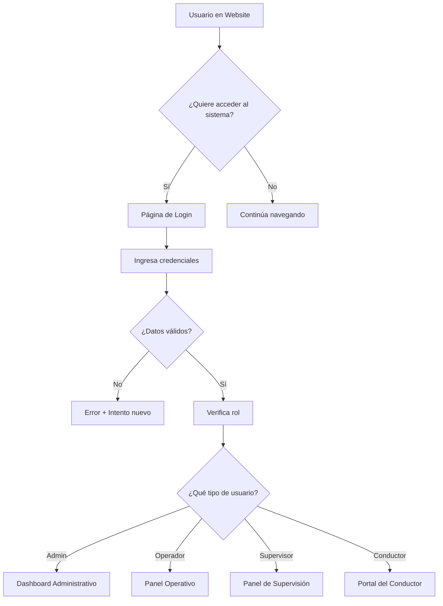

# 🛵 Primero de Junio - Asociación de Mototaxis
### **PROPUESTA DE PROYECTO INTEGRAL**

<div align="center">


**🚀 SOLUCIÓN TECNOLÓGICA COMPLETA PARA LA MODERNIZACIÓN DIGITAL**

[]()
[]()
[]()
[]()

</div>

---

## 📋 **RESUMEN EJECUTIVO**

Esta propuesta presenta una **solución tecnológica integral** compuesta por **tres componentes interconectados** que transformarán digitalmente las operaciones de la Asociación de Mototaxis "Primero de Junio":

1. **🌐 WEBSITE INSTITUCIONAL** - Presencia digital profesional y captación de clientes
2. **🔐 SISTEMA DE AUTENTICACIÓN** - Puente de conexión seguro entre ambas plataformas  
3. **🏢 SISTEMA ADMINISTRATIVO** - Gestión operativa completa y automatizada

### 🎯 **OBJETIVOS DEL PROYECTO**

| 🎯 **Objetivo** | 📊 **Impacto Esperado** | ⏱️ **Tiempo** |
|---|---|---|
| **Modernizar la imagen institucional** | +300% en presencia digital | 15 días |
| **Automatizar procesos administrativos** | -70% tiempo en gestión manual | 30 días |
| **Centralizar información operativa** | +100% control de datos | 20 días |
| **Mejorar experiencia del cliente** | +250% satisfacción | 25 días |
| **Incrementar eficiencia operativa** | +150% productividad | 30 días |

---

# 🌐 **PARTE 1: WEBSITE INSTITUCIONAL**
## **"Su Ventana Digital al Mundo"**

### 🎨 **DISEÑO Y EXPERIENCIA VISUAL**

El website será la **carta de presentación digital** de la asociación, diseñado con tecnologías modernas y estándares internacionales de UX/UI.

#### 🚀 **Tecnologías de Vanguardia**

| 💻 **Tecnología** | 🎯 **Propósito** | ⚡ **Beneficio** |
|---|---|---|
| **React 18.2** | Framework frontend moderno | Interfaz rápida y dinámica |
| **Vite 4.4.5** | Herramienta de construcción | Carga ultrarrápida |
| **Framer Motion** | Animaciones profesionales | Experiencia inmersiva |
| **Responsive Design** | Adaptación multi-dispositivo | Acceso desde cualquier lugar |
| **PWA Ready** | Aplicación web progresiva | Funciona como app móvil |

### 📱 **PÁGINAS Y FUNCIONALIDADES DETALLADAS**

#### 🏠 **1. PÁGINA PRINCIPAL (HOME)**
**La primera impresión que determinará el éxito de su presencia digital**

<details>
<summary><strong>🎯 Sección Hero - Impacto Visual Inmediato</strong></summary>

**Características:**
- **Slider de imágenes HD** de mototaxis en acción
- **Texto dinámico animado** con los valores de la asociación
- **Botón CTA prominente** para "Únete Como Conductor"
- **Contador de estadísticas** en tiempo real
- **Video promocional** con reproducción automática (opcional)

**Mensajes Clave:**
- "Primero de Junio - Líderes en Transporte Urbano"
- "Más de X conductores confían en nosotros"
- "Servicios 24/7 en toda la ciudad"

**Elementos Interactivos:**
- Animaciones de entrada suaves
- Partículas de fondo animadas
- Botones con efectos hover
- Transiciones fluidas entre slides
</details>

<details>
<summary><strong>🛵 Sección de Servicios Destacados</strong></summary>

**Grid de Servicios Principales:**
- **🚗 Transporte Urbano** - Servicio básico de mototaxi
- **🏥 Servicio Médico** - Traslados de emergencia
- **📦 Delivery Express** - Envío de paquetes
- **🎓 Capacitación** - Formación de conductores
- **🛡️ Seguro Integral** - Protección completa
- **🔧 Mantenimiento** - Servicio técnico especializado

**Cada Servicio Incluye:**
- Icono animado personalizado
- Descripción concisa del beneficio
- Precio aproximado o "Consultar"
- Enlace a página detallada
- Testimonios breves de usuarios
</details>

<details>
<summary><strong>📊 Panel de Estadísticas en Vivo</strong></summary>

**Contadores Animados:**
- **+150** Conductores Activos
- **+5,000** Viajes Completados
- **98%** Satisfacción del Cliente
- **24/7** Servicio Disponible
- **15** Rutas Principales

**Gráficos Dinámicos:**
- Mapa de cobertura interactivo
- Tiempo promedio de respuesta
- Zonas de mayor demanda
- Horarios pico de servicio
</details>

<details>
<summary><strong>💬 Testimonios de Conductores y Clientes</strong></summary>

**Carrusel de Testimonios:**
- **María González** - "Gracias a Primero de Junio logré independencia económica"
- **Roberto Silva** - "Cambié la construcción por el mototaxi, mejor decisión"
- **Carmen López** - "Como madre soltera, la flexibilidad horaria es perfecta"

**Cada Testimonio Incluye:**
- Foto del conductor/cliente
- Nombre y ocupación anterior
- Historia de éxito breve
- Incremento de ingresos (%)
- Certificación obtenida
- Rating de 5 estrellas
</details>

<details>
<summary><strong>📞 Formulario de Contacto Inteligente</strong></summary>

**Campos Dinámicos:**
- Tipo de consulta (Conductor, Cliente, Servicios)
- Datos de contacto
- Zona de interés
- Disponibilidad horaria
- Mensaje personalizado

**Funcionalidades:**
- Validación en tiempo real
- Autocompletado de direcciones
- Estimación automática de tarifas
- Respuesta automática vía email
- Integración con WhatsApp
</details>

#### 🛵 **2. PÁGINA DE SERVICIOS**
**Catálogo completo de soluciones para conductores y clientes**

<details>
<summary><strong>🎓 Servicios para Conductores</strong></summary>

**Capacitación y Certificación:**
- **Curso Básico de Conducción** - 2 semanas - $150
- **Manejo Defensivo Avanzado** - 1 semana - $100
- **Primeros Auxilios** - 3 días - $75
- **Atención al Cliente** - 2 días - $50
- **Mecánica Básica** - 1 semana - $120

**Servicios de Apoyo:**
- **Gestión de Documentos** - Renovación de licencias
- **Seguro Integral** - Cobertura completa
- **Financiamiento de Vehículos** - Planes accesibles
- **Mantenimiento Programado** - Talleres especializados
- **Asesoría Legal** - Consultas gratuitas
</details>

<details>
<summary><strong>🚗 Servicios para Clientes</strong></summary>

**Modalidades de Transporte:**
- **Servicio Regular** - Tarifas estándar
- **Servicio Express** - +30% rapidez
- **Servicio Nocturno** - Disponible 24h
- **Servicio Corporativo** - Empresas
- **Servicio Turístico** - Recorridos especiales

**Servicios Especializados:**
- **Traslado Médico** - Personal capacitado
- **Delivery de Medicamentos** - Urgencias
- **Transporte Escolar** - Niños y adolescentes
- **Servicios de Mudanza** - Objetos pequeños
- **Courier Express** - Documentos importantes
</details>

<details>
<summary><strong>💼 Paquetes y Membresías</strong></summary>

**Para Conductores:**
- **Paquete Starter** - $200/mes - Básico
- **Paquete Professional** - $350/mes - Completo
- **Paquete VIP** - $500/mes - Premium con beneficios

**Para Clientes:**
- **Membresía Básica** - Gratuita
- **Membresía Premium** - $20/mes - Descuentos
- **Membresía Corporativa** - Empresas - Consultar
</details>

#### 👨‍💼 **3. PÁGINA DE CONDUCTORES**
**Portal de reclutamiento y información para aspirantes**

<details>
<summary><strong>🎯 Requisitos y Perfil del Conductor Ideal</strong></summary>

**Requisitos Mínimos:**
- ✅ Edad: 21-55 años
- ✅ Licencia de conducir vigente (Categoría A)
- ✅ Antecedentes penales limpios
- ✅ Examen médico aprobado
- ✅ Conocimiento básico de rutas
- ✅ Disponibilidad mínima 6 horas/día

**Perfil Preferencial:**
- 🌟 Experiencia previa en transporte
- 🌟 Actitud de servicio al cliente
- 🌟 Responsabilidad y puntualidad
- 🌟 Conocimiento de primeros auxilios
- 🌟 Manejo de smartphone
</details>

<details>
<summary><strong>💰 Beneficios y Compensaciones</strong></summary>

**Ingresos Potenciales:**
- **Conductor Tiempo Completo:** $800-1,200/mes
- **Conductor Medio Tiempo:** $400-600/mes
- **Bonos por Rendimiento:** Hasta $200/mes adicionales
- **Incentivos Especiales:** Fines de semana +20%

**Beneficios Adicionales:**
- 🏥 Seguro médico familiar
- 🛡️ Seguro de vida
- 🔧 Mantenimiento gratuito del vehículo
- 🎓 Capacitación continua sin costo
- 📱 App móvil para gestión de viajes
- 🏆 Programa de reconocimientos
</details>

<details>
<summary><strong>📋 Proceso de Afiliación Paso a Paso</strong></summary>

**Paso 1: Aplicación Online (5 min)**
- Formulario básico de datos
- Subida de documentos digitalizados
- Verificación automática inicial

**Paso 2: Entrevista Personal (30 min)**
- Evaluación presencial
- Prueba de conocimientos viales
- Verificación de documentos

**Paso 3: Examen Médico (1 hora)**
- Centro médico autorizado
- Evaluación física y psicológica
- Pruebas de vista y reflejos

**Paso 4: Capacitación Básica (2 semanas)**
- Curso de conducción defensiva
- Atención al cliente
- Uso de la aplicación móvil

**Paso 5: Período de Prueba (1 mes)**
- Acompañamiento de conductor experimentado
- Evaluación de rendimiento
- Certificación final
</details>

#### 🏢 **4. PÁGINA DE LA ASOCIACIÓN**
**Información institucional y corporativa**

<details>
<summary><strong>📜 Historia y Misión Institucional</strong></summary>

**Nuestra Historia:**
- **Fundación:** 1° de Junio de 2018
- **Fundadores:** 12 conductores visionarios
- **Crecimiento:** De 12 a 150+ conductores
- **Reconocimientos:** 5 premios municipales
- **Impacto Social:** +5,000 familias beneficiadas

**Misión:**
"Proporcionar servicios de transporte seguro, confiable y accesible, mientras generamos oportunidades de empleo digno para nuestros conductores asociados."

**Visión 2025:**
"Ser la asociación de mototaxis líder en Bolivia, reconocida por su profesionalismo, innovación tecnológica y compromiso social."
</details>

<details>
<summary><strong>🏆 Certificaciones y Reconocimientos</strong></summary>

**Certificaciones Institucionales:**
- 🏅 ISO 9001:2015 - Gestión de Calidad
- 🏅 Certificación Municipal de Transporte
- 🏅 Registro Nacional de Asociaciones
- 🏅 Certificación Ambiental
- 🏅 Sello de Empresa Socialmente Responsable

**Premios y Reconocimientos:**
- 🏆 "Mejor Asociación de Transporte 2023"
- 🏆 "Innovación en Movilidad Urbana 2022"
- 🏆 "Generación de Empleo 2021"
- 🏆 "Responsabilidad Social 2020"
- 🏆 "Excelencia en Servicio 2019"
</details>

<details>
<summary><strong>👥 Estructura Organizacional</strong></summary>

**Directorio Ejecutivo:**
- **Presidente:** Juan Carlos Mendoza
- **Vicepresidente:** María Elena Vargas
- **Secretario:** Roberto Fernández
- **Tesorero:** Ana Lucia Castro
- **Vocal 1:** Carlos Mamani
- **Vocal 2:** Patricia Morales

**Departamentos Operativos:**
- 🚗 **Operaciones** - Gestión diaria de servicios
- 👥 **Recursos Humanos** - Selección y capacitación
- 💰 **Finanzas** - Control económico
- 🔧 **Mantenimiento** - Soporte técnico
- 📢 **Marketing** - Promoción y ventas
- ⚖️ **Legal** - Asesoría jurídica
</details>

#### ℹ️ **5. PÁGINA NOSOTROS**
**Valores, cultura organizacional y equipo humano**

<details>
<summary><strong>💡 Valores y Principios Fundamentales</strong></summary>

**Nuestros Valores:**
- **🤝 HONESTIDAD** - Transparencia en todas nuestras operaciones
- **🛡️ SEGURIDAD** - Prioridad absoluta en cada viaje
- **⭐ EXCELENCIA** - Mejora continua en el servicio
- **🌱 RESPONSABILIDAD** - Compromiso social y ambiental
- **🚀 INNOVACIÓN** - Adopción de nuevas tecnologías
- **👥 TRABAJO EN EQUIPO** - Colaboración y apoyo mutuo

**Principios Operativos:**
- ✅ El cliente siempre es nuestra prioridad
- ✅ Cada conductor es un embajador de la marca
- ✅ La capacitación es clave para el crecimiento
- ✅ La tecnología nos hace más eficientes
- ✅ El respeto mutuo fortalece la organización
</details>

<details>
<summary><strong>🎯 Objetivos Estratégicos 2024-2025</strong></summary>

**Crecimiento Operativo:**
- 📈 Incrementar la flota a 200 mototaxis
- 📈 Expandir cobertura a 5 ciudades nuevas
- 📈 Alcanzar 10,000 viajes mensuales
- 📈 Mantener 98% de satisfacción del cliente

**Desarrollo Tecnológico:**
- 💻 Lanzar aplicación móvil propia
- 💻 Implementar sistema GPS en tiempo real
- 💻 Integrar pagos digitales
- 💻 Desarrollar programa de fidelización

**Impacto Social:**
- 🌍 Generar 100 empleos directos nuevos
- 🌍 Capacitar 50 conductores en oficios complementarios
- 🌍 Implementar programa de becas estudiantiles
- 🌍 Reducir 30% las emisiones con vehículos eléctricos
</details>

#### 📞 **6. PÁGINA DE CONTACTO**
**Múltiples canales de comunicación y atención**

<details>
<summary><strong>📍 Información de Contacto Completa</strong></summary>

**Oficina Principal:**
- 📧 **Email:** info@primero1dejunio.com
- 📱 **WhatsApp:** +591 7XXXXXXX (24/7)
- ☎️ **Teléfono:** +591 4XXXXXXX
- 📍 **Dirección:** Av. Principal #123, Santa Cruz, Bolivia
- 🕐 **Horarios:** Lunes a Viernes 8:00-18:00, Sábados 8:00-12:00

**Contactos Departamentales:**
- 🚗 **Operaciones:** operaciones@primero1dejunio.com
- 👥 **Recursos Humanos:** rrhh@primero1dejunio.com
- 💰 **Facturación:** facturacion@primero1dejunio.com
- 🔧 **Soporte Técnico:** soporte@primero1dejunio.com
- 📢 **Marketing:** marketing@primero1dejunio.com
</details>

<details>
<summary><strong>🗺️ Mapa Interactivo y Ubicaciones</strong></summary>

**Oficinas y Puntos de Servicio:**
- 🏢 **Sede Principal** - Centro de la ciudad
- 🏢 **Sucursal Norte** - Zona residencial
- 🏢 **Sucursal Sur** - Área comercial
- 🔧 **Taller Principal** - Mantenimiento
- 🔧 **Taller Secundario** - Reparaciones rápidas

**Cobertura de Servicio:**
- Mapa interactivo con zonas de cobertura
- Tiempo estimado de llegada por zona
- Tarifas referenciales por distancia
- Puntos de interés principales
</details>

<details>
<summary><strong>📝 Formularios Especializados</strong></summary>

**Formulario de Contacto General:**
- Tipo de consulta (desplegable)
- Datos personales básicos
- Mensaje detallado
- Adjuntar archivos (opcional)
- Preferencia de contacto

**Formulario de Afiliación Express:**
- Datos del aspirante a conductor
- Disponibilidad horaria
- Experiencia previa
- Referencias personales
- Documentos básicos

**Formulario de Quejas y Sugerencias:**
- Tipo de incidencia
- Detalles del evento
- Conductor involucrado (si aplica)
- Nivel de urgencia
- Solución esperada
</details>

### 🎨 **CARACTERÍSTICAS TÉCNICAS AVANZADAS**

#### ⚡ **Rendimiento y Optimización**
- **Tiempo de Carga:** <2 segundos
- **Lighthouse Score:** 95+/100
- **Core Web Vitals:** Excelente
- **Compresión de Imágenes:** WebP/AVIF
- **CDN:** Distribución global de contenido
- **Caché Inteligente:** Actualización automática

#### 📱 **Responsividad Total**
- **Móvil First:** Diseño prioritario para celulares
- **Breakpoints:** 320px, 768px, 1024px, 1440px+
- **Touch Friendly:** Botones optimizados para táctil
- **Orientación:** Vertical y horizontal
- **PWA Ready:** Instalable como app

#### 🔍 **SEO y Marketing Digital**
- **Meta Tags Dinámicos:** Cada página optimizada
- **Schema Markup:** Datos estructurados
- **Sitemap XML:** Indexación automática
- **Google Analytics 4:** Seguimiento avanzado
- **Facebook Pixel:** Remarketing
- **Open Graph:** Compartir en redes sociales

---

# 🔐 **PARTE 2: SISTEMA DE AUTENTICACIÓN**
## **"El Puente Seguro Entre Mundos"**

El sistema de autenticación es el **corazón de la seguridad** y el **punto de conexión estratégico** entre el website público y el sistema administrativo privado. Representa la **transición del cliente interesado al usuario autorizado**.

### 🎯 **CONCEPTO ESTRATÉGICO**

El sistema de login no es solo una barrera de seguridad, sino un **embudo de conversión inteligente** que:
- **Filtra** visitantes y los convierte en usuarios registrados
- **Segmenta** automáticamente según el tipo de usuario
- **Personaliza** la experiencia según el rol asignado
- **Protege** información sensible con múltiples capas de seguridad

### 🏗️ **ARQUITECTURA DE AUTENTICACIÓN**

#### 🔒 **Niveles de Seguridad Implementados**

<details>
<summary><strong>🛡️ Capa 1: Validación Frontend</strong></summary>

**Validaciones Inmediatas:**
- ✅ Formato de email válido
- ✅ Contraseña mínima 8 caracteres
- ✅ Verificación de campos obligatorios
- ✅ Prevención de inyección XSS
- ✅ Encriptación de datos en tránsito

**Experiencia de Usuario:**
- Retroalimentación visual instantánea
- Indicadores de seguridad de contraseña
- Autocompletado inteligente
- Recuperación de sesión automática
</details>

<details>
<summary><strong>🔐 Capa 2: Autenticación Backend</strong></summary>

**Validación Servidor (PHP):**
- ✅ Hash de contraseñas con BCrypt
- ✅ Verificación contra base de datos
- ✅ Prevención de ataques de fuerza bruta
- ✅ Logs de intentos de acceso
- ✅ Bloqueo temporal tras fallos

**Tokens de Seguridad:**
- JWT para sesiones activas
- Tokens de actualización automática
- Expiración configurable por rol
- Invalidación remota de sesiones
</details>

<details>
<summary><strong>🏰 Capa 3: Autorización por Roles</strong></summary>

**Sistema de Roles Dinámico:**
- **👑 ADMINISTRADOR** - Acceso total al sistema
- **👨‍💼 OPERADOR** - Gestión operativa diaria
- **👥 SUPERVISOR** - Monitoreo y reportes
- **🚗 CONDUCTOR** - Panel personal limitado

**Permisos Granulares:**
- Control por módulo del sistema
- Restricciones por horario
- Límites de acceso por IP
- Auditoría completa de acciones
</details>

### 🎨 **DISEÑO DE LA INTERFAZ DE LOGIN**

#### 🌟 **Página de Acceso Profesional**

**Elementos Visuales:**
- **Background Animado** con mototaxis en movimiento
- **Logo Institucional** prominente y centrado
- **Formulario Moderno** con efectos glassmorphism
- **Colores Corporativos** coherentes con la marca
- **Animaciones Suaves** que generan confianza

**Campos del Formulario:**
```
📧 Email/Usuario    [________________________]
🔒 Contraseña       [________________________] 👁️
🔄 Recordarme       [✓] Mantener sesión activa
                    [🏍️ ACCESO MOTOTAXI      ]
```

**Enlaces Adicionales:**
- 🔗 "¿Olvidaste tu contraseña?" - Recuperación automática
- 🔗 "¿No tienes cuenta?" - Registro de nuevos conductores
- 🔗 "Problemas de acceso?" - Soporte técnico directo

#### 📱 **Versión Móvil Optimizada**

**Características Mobile:**
- Touch ID / Face ID (dispositivos compatibles)
- Teclado numérico para códigos
- Botones grandes para facilitar el toque
- Orientación automática
- Instalación como PWA

### 🔄 **FLUJO DE AUTENTICACIÓN INTELIGENTE**

#### 📊 **Proceso de Login Paso a Paso**



#### 🎯 **Redirección Inteligente por Roles**

<details>
<summary><strong>👑 ADMINISTRADOR - Dashboard Ejecutivo</strong></summary>

**Primera Pantalla:**
- Resumen ejecutivo de todas las operaciones
- Métricas clave: ingresos, conductores, viajes, clientes
- Gráficos de tendencias y comparativos
- Alertas críticas del sistema
- Acceso a todos los módulos

**Menú Principal:**
- 👥 Gestión de Usuarios y Roles
- 🚗 Flota de Vehículos
- 📊 Reportes y Analytics
- ⚙️ Configuración del Sistema
- 🔧 Mantenimiento y Logs
</details>

<details>
<summary><strong>👨‍💼 OPERADOR - Centro de Control</strong></summary>

**Primera Pantalla:**
- Viajes en tiempo real
- Solicitudes pendientes
- Conductores disponibles
- Mapa de operaciones
- Comunicación directa

**Funciones Principales:**
- 📋 Asignación de viajes
- 📞 Gestión de llamadas
- 🗺️ Control de rutas
- 💰 Tarifas y cobros
- 📱 Coordinación de conductores
</details>

<details>
<summary><strong>👥 SUPERVISOR - Monitor de Calidad</strong></summary>

**Primera Pantalla:**
- Métricas de calidad del servicio
- Reportes de conductores
- Quejas y sugerencias
- Indicadores de rendimiento
- Plan de mejoras

**Responsabilidades:**
- 📈 Monitoreo de KPIs
- 👥 Evaluación de conductores
- 📝 Reportes de calidad
- 🎓 Programas de capacitación
- 🏆 Sistema de reconocimientos
</details>

<details>
<summary><strong>🚗 CONDUCTOR - Portal Personal</strong></summary>

**Primera Pantalla:**
- Resumen de viajes del día
- Ingresos acumulados
- Próximas asignaciones
- Mensajes del despachador
- Estado del vehículo

**Herramientas Disponibles:**
- 📱 Recepción de viajes
- 🗺️ Navegación GPS
- 💰 Control de ingresos
- 📞 Comunicación con base
- 🎓 Capacitaciones online
</details>

### 🔄 **GESTIÓN DE SESIONES Y SEGURIDAD**

#### ⏰ **Política de Sesiones**

| 👤 **Rol** | ⏱️ **Duración** | 🔄 **Renovación** | 📱 **Dispositivos** |
|---|---|---|---|
| **Administrador** | 8 horas | Automática | 3 simultáneos |
| **Operador** | 12 horas | Manual cada 4h | 2 simultáneos |
| **Supervisor** | 8 horas | Automática | 2 simultáneos |
| **Conductor** | 24 horas | Automática | 1 dispositivo |

#### 🛡️ **Características de Seguridad Avanzada**

- **🔐 Autenticación de Dos Factores (2FA)** - Opcional para admins
- **📱 Códigos SMS** - Verificación en dispositivos nuevos
- **🕒 Horarios de Acceso** - Restricciones por rol y horario
- **🌍 Geolocalización** - Alertas de acceso desde ubicaciones inusuales
- **🔍 Auditoría Completa** - Log de todas las acciones realizadas

#### 🚨 **Sistema de Alertas y Notificaciones**

**Alertas de Seguridad:**
- Intentos de acceso fallidos múltiples
- Acceso desde dispositivos no reconocidos
- Cambios de contraseña
- Sesiones simultáneas detectadas
- Actividad fuera del horario permitido

**Notificaciones del Sistema:**
- Nuevos usuarios registrados
- Cambios en configuraciones críticas
- Mantenimientos programados
- Actualizaciones del sistema
- Reportes automáticos semanales

---

# 🏢 **PARTE 3: SISTEMA ADMINISTRATIVO**
## **"El Cerebro Operativo de la Asociación"**

El sistema administrativo es el **núcleo tecnológico** que controlará todas las operaciones diarias de la asociación. Diseñado como una **plataforma integral de gestión empresarial** específicamente adaptada para el negocio del transporte en mototaxi.

### 🎯 **ARQUITECTURA EMPRESARIAL**

#### 💻 **Stack Tecnológico Robusto**

| 🔧 **Tecnología** | 📊 **Versión** | 🎯 **Función Específica** | ⚡ **Ventaja Competitiva** |
|---|---|---|---|
| **PHP 8.1+** | Última estable | Lógica de negocio backend | 40% más rápido que versiones anteriores |
| **MySQL 8.0** | Enterprise ready | Base de datos principal | Soporte para JSON nativo y GIS |
| **Apache/Nginx** | 2.4+ | Servidor web | Configuración optimizada para PHP |
| **Redis** | 6.2+ | Cache y sesiones | 10x más rápido que sistema de archivos |
| **jQuery 3.6** | Última LTS | Interactividad frontend | Compatible con todos los navegadores |
| **Bootstrap 5** | Framework CSS | Diseño responsivo | Mobile-first approach |
| **Chart.js** | 4.0+ | Gráficos y dashboards | Visualización de datos profesional |

#### 🏗️ **Patrón de Arquitectura MVC Avanzado**

```
📁 SISTEMA ADMINISTRATIVO
├── 🎯 CONTROLLERS (Lógica de Control)
│   ├── AdminController.php          # Funciones administrativas generales
│   ├── AuthController.php           # Autenticación y autorización
│   ├── DashboardController.php      # Métricas y estadísticas
│   ├── UsuarioController.php        # Gestión de usuarios del sistema
│   ├── ConductorController.php      # Gestión específica de conductores
│   ├── VehiculoController.php       # Control de flota de vehículos
│   ├── ClienteController.php        # Base de datos de clientes
│   ├── ViajeController.php          # Gestión de servicios y viajes
│   ├── PagoTarifaDiariaController.php # Control financiero
│   ├── ConfiguracionController.php  # Parámetros del sistema
│   ├── OperadorController.php       # Funciones de operadores
│   └── PermisoController.php        # Control de acceso granular
│
├── 📊 MODELS (Lógica de Datos)
│   ├── Usuario.php                  # Modelo de usuarios sistema
│   ├── Conductor.php               # Perfil de conductores
│   ├── Vehiculo.php                # Información de vehículos
│   ├── Cliente.php                 # Base de clientes
│   ├── Viaje.php                   # Registro de servicios
│   ├── Tarifa.php                  # Sistema de precios
│   ├── PagoTarifaDiaria.php        # Control de pagos
│   ├── Configuracion.php           # Parámetros configurables
│   ├── Rol.php                     # Roles del sistema
│   ├── Permiso.php                 # Permisos granulares
│   └── Perfil.php                  # Perfiles de usuario
│
└── 🎨 VIEWS (Presentación)
    ├── dashboard/                   # Dashboards por rol
    ├── usuarios/                    # Gestión de usuarios
    ├── conductores/                 # Módulo de conductores
    ├── vehiculos/                   # Gestión de flota
    ├── viajes/                      # Control de servicios
    ├── clientes/                    # Base de clientes
    ├── pagos/                       # Sistema financiero
    ├── reportes/                    # Generación de reportes
    ├── configuraciones/             # Ajustes del sistema
    └── layouts/                     # Templates base
```

### 📊 **MÓDULOS OPERATIVOS DETALLADOS**

#### 👑 **1. MÓDULO DE ADMINISTRACIÓN GENERAL**
**El centro de comando para la toma de decisiones estratégicas**

<details>
<summary><strong>🎯 Dashboard Ejecutivo - Vista de 360°</strong></summary>

**Métricas en Tiempo Real:**
- 💰 **Ingresos Diarios:** $2,450 (↑15% vs ayer)
- 🚗 **Conductores Activos:** 45/150 (30% en línea)
- 🛣️ **Viajes Completados:** 234 hoy
- ⭐ **Rating Promedio:** 4.8/5.0
- 🕒 **Tiempo Respuesta:** 8.5 minutos promedio

**Gráficos Interactivos:**
- **Ingresos por Hora** - Gráfico de líneas con predicción
- **Viajes por Zona** - Mapa de calor interactivo
- **Conductores vs Demanda** - Análisis de capacidad
- **Satisfacción del Cliente** - Tendencias mensuales
- **Costos Operativos** - Desglose detallado

**Alertas Críticas:**
- 🚨 3 conductores con documentos próximos a vencer
- ⚠️ Zona Norte con alta demanda, pocos conductores
- 🔴 Cliente VIP esperando más de 15 minutos
- 💡 Oportunidad: Incrementar tarifas en hora pico
</details>

<details>
<summary><strong>📈 Sistema de Reportes Avanzados</strong></summary>

**Reportes Financieros:**
- **Reporte Diario de Ingresos** - PDF/Excel automático
- **Estado de Cuentas por Conductor** - Individual
- **Análisis de Rentabilidad** - Por vehículo/conductor
- **Proyecciones Financieras** - Modelos predictivos
- **Control de Gastos** - Categorización automática

**Reportes Operativos:**
- **Eficiencia de Conductores** - KPIs individuales
- **Análisis de Rutas** - Optimización de trayectos
- **Tiempo de Respuesta** - Por zona y horario
- **Utilización de Flota** - Aprovechamiento de vehículos
- **Incidencias y Reclamos** - Seguimiento completo

**Reportes Estratégicos:**
- **Análisis de Mercado** - Competencia y oportunidades
- **Satisfacción del Cliente** - Encuestas y feedback
- **Crecimiento y Expansión** - Nuevas zonas potenciales
- **ROI por Conductor** - Retorno de inversión individual
</details>

#### 👥 **2. GESTIÓN INTEGRAL DE CONDUCTORES**
**El capital humano es nuestro activo más valioso**

<details>
<summary><strong>📋 Registro y Perfilado Completo</strong></summary>

**Información Personal:**
```
👤 DATOS BÁSICOS
├── Nombre completo
├── Cédula de identidad
├── Fecha de nacimiento
├── Estado civil
├── Número de dependientes
├── Dirección completa
├── Teléfonos (principal y emergencia)
├── Email personal
└── Foto actualizada

🏥 INFORMACIÓN MÉDICA
├── Tipo de sangre
├── Alergias conocidas
├── Medicamentos que toma
├── Contacto médico de emergencia
├── Fecha último examen médico
└── Restricciones de salud

🚗 EXPERIENCIA PROFESIONAL
├── Años de experiencia conduciendo
├── Trabajos anteriores en transporte
├── Licencias y certificaciones
├── Cursos de capacitación tomados
├── Idiomas que habla
└── Habilidades especiales
```

**Control de Documentación:**
- 📄 Licencia de conducir (vigencia y categoría)
- 📋 Certificado médico (renovación anual)
- 🏥 Seguro SOAT (seguimiento automático)
- 👮 Antecedentes penales (verificación periódica)
- 🎓 Certificados de capacitación (registro completo)
- 📱 Registro en aplicación móvil (estado activo)
</details>

<details>
<summary><strong>📊 Sistema de Evaluación y Desempeño</strong></summary>

**KPIs de Rendimiento Individual:**
- ⭐ **Rating Promedio:** 4.7/5.0 (últimos 30 días)
- 🎯 **Tasa de Aceptación:** 95% (meta: 90%)
- ⏱️ **Tiempo de Respuesta:** 6.2 min (meta: <8 min)
- 🛣️ **Viajes Completados:** 127 este mes
- 💰 **Ingresos Generados:** $1,250 este mes
- 🚫 **Cancelaciones:** 2% (meta: <5%)
- 📞 **Quejas Recibidas:** 1 este mes
- 🏆 **Bonos Ganados:** $150 este mes

**Sistema de Ranking:**
- 🥇 **Top 10%** - Conductor Estrella (beneficios premium)
- 🥈 **Top 25%** - Conductor Destacado (bonos adicionales)
- 🥉 **Top 50%** - Conductor Estándar (beneficios normales)
- ⚠️ **Bottom 20%** - Plan de mejoramiento (capacitación)

**Plan de Desarrollo Personal:**
- 🎓 Cursos recomendados específicos
- 📈 Metas mensuales personalizadas
- 👨‍🏫 Mentorías con conductores experimentados
- 🏆 Programa de incentivos personalizado
</details>

<details>
<summary><strong>💰 Control Financiero del Conductor</strong></summary>

**Estado de Cuenta Individual:**
```
📊 RESUMEN FINANCIERO - Juan Pérez (Conductor #025)
┌─────────────────────────────────────────────────┐
│ 💰 INGRESOS NOVIEMBRE 2024                     │
├─────────────────────────────────────────────────┤
│ Viajes Completados: 127 servicios              │
│ Ingresos Brutos: $1,250.00                     │
│ Propinas Recibidas: $89.50                     │
│ Bonos de Rendimiento: $150.00                  │
│ ═══════════════════════════════════════════════ │
│ TOTAL INGRESOS: $1,489.50                      │
├─────────────────────────────────────────────────┤
│ 💸 DESCUENTOS Y COMISIONES                     │
├─────────────────────────────────────────────────┤
│ Comisión Asociación (8%): $100.00              │
│ Tarifa Diaria Sistema: $45.00                  │
│ Seguro Vehículo: $35.00                        │
│ Mantenimiento: $25.00                          │
│ Combustible Avance: $80.00                     │
│ ═══════════════════════════════════════════════ │
│ TOTAL DESCUENTOS: $285.00                      │
├─────────────────────────────────────────────────┤
│ 💵 NETO A PAGAR: $1,204.50                     │
└─────────────────────────────────────────────────┘
```

**Histórico de Pagos:**
- 📅 Registro completo de pagos mensuales
- 📊 Gráficos de evolución de ingresos
- 🔍 Detalle de cada descuento aplicado
- 💳 Métodos de pago configurados
- 📧 Comprobantes enviados automáticamente
</details>

#### 🚗 **3. GESTIÓN AVANZADA DE FLOTA**
**Control total de los activos más importantes**

<details>
<summary><strong>📋 Registro Técnico Completo</strong></summary>

**Información del Vehículo:**
```
🚗 FICHA TÉCNICA - Mototaxi #MT-047
┌─────────────────────────────────────────────────┐
│ 🔧 DATOS TÉCNICOS                               │
├─────────────────────────────────────────────────┤
│ Marca: Bajaj                                    │
│ Modelo: RE Compact 4S Plus                     │
│ Año: 2023                                       │
│ Color: Amarillo/Negro                           │
│ Placa: ABC-1234                                 │
│ VIN: 123456789ABCDEFGH                          │
│ Motor: 236.2cc, 4 tiempos                      │
│ Combustible: Gasolina Especial                 │
│ Capacidad: 3 pasajeros + conductor             │
│ Kilometraje: 15,450 km                         │
├─────────────────────────────────────────────────┤
│ 📄 DOCUMENTACIÓN                               │
├─────────────────────────────────────────────────┤
│ SOAT: Vigente hasta 15/08/2025                 │
│ Revisión Técnica: Vigente hasta 01/06/2025    │
│ Permiso Municipal: Vigente hasta 31/12/2024   │
│ Tarjeta Propiedad: Original en archivo         │
│ Póliza Seguro: Cobertura total activa          │
├─────────────────────────────────────────────────┤
│ 👨‍💼 ASIGNACIÓN ACTUAL                           │
├─────────────────────────────────────────────────┤
│ Conductor: Juan Carlos Pérez                   │
│ Fecha Asignación: 15/03/2024                   │
│ Turno: Matutino (06:00 - 14:00)               │
│ Estado: Activo en servicio                     │
│ Último Servicio: Hace 12 minutos              │
└─────────────────────────────────────────────────┘
```

**Control de Estados:**
- 🟢 **Activo** - En servicio normal
- 🟡 **Mantenimiento** - En taller programado
- 🔴 **Fuera de Servicio** - Problema técnico
- 🔵 **Disponible** - Sin asignar a conductor
- ⚫ **Baja** - Fuera de la flota definitivamente
</details>

<details>
<summary><strong>🔧 Sistema de Mantenimiento Predictivo</strong></summary>

**Programa de Mantenimiento Automático:**
```
🛠️ CRONOGRAMA MANTENIMIENTO - Mototaxi #MT-047
┌─────────────────────────────────────────────────┐
│ ⏰ PRÓXIMOS SERVICIOS                           │
├─────────────────────────────────────────────────┤
│ 🔴 URGENTE (vence en 3 días)                   │
│ ├── Cambio de aceite (cada 1,000 km)          │
│ └── Revisión frenos (cada 2,000 km)           │
├─────────────────────────────────────────────────┤
│ 🟡 PROGRAMADO (próximas 2 semanas)             │
│ ├── Alineación y balanceo                     │
│ ├── Revisión sistema eléctrico                │
│ └── Cambio filtro aire                        │
├─────────────────────────────────────────────────┤
│ 🟢 PLANIFICADO (próximo mes)                   │
│ ├── Servicio mayor (5,000 km)                 │
│ ├── Revisión técnica renovación               │
│ └── Actualización documentos                  │
└─────────────────────────────────────────────────┘
```

**Alertas Automatizadas:**
- 📧 **Email al conductor** 7 días antes del vencimiento
- 📱 **SMS recordatorio** 3 días antes
- 🚨 **Alerta en dashboard** cuando vence
- 🔒 **Bloqueo automático** si no se realiza mantenimiento crítico
- 📊 **Reporte semanal** de mantenimientos pendientes

**Proveedores de Servicio:**
- 🔧 **Taller Principal** - Mantenimientos mayores
- ⚡ **Taller Express** - Servicios rápidos
- 🛞 **Llantera Autorizada** - Neumáticos y alineación
- 🔋 **Servicio Eléctrico** - Sistema eléctrico especializado
- 🎨 **Pintura y Carrocería** - Mantenimiento estético
</details>

#### 🛣️ **4. CENTRO DE CONTROL OPERATIVO**
**El corazón que bombea vida a toda la operación**

<details>
<summary><strong>📞 Central de Llamadas Inteligente</strong></summary>

**Sistema de Recepción de Solicitudes:**
```
📞 CENTRAL DE LLAMADAS - Turno Matutino
┌─────────────────────────────────────────────────┐
│ 📊 MÉTRICAS EN TIEMPO REAL                     │
├─────────────────────────────────────────────────┤
│ Llamadas Recibidas: 47 (últimas 2 horas)      │
│ Tiempo Respuesta Promedio: 8 segundos          │
│ Servicios Asignados: 43 (91% conversión)      │
│ Llamadas Perdidas: 2 (4% tasa)                │
│ Operadores Activos: 3/4 disponibles           │
├─────────────────────────────────────────────────┤
│ 🚨 SOLICITUDES PENDIENTES                      │
├─────────────────────────────────────────────────┤
│ #2024-001547 | Plaza Principal → Hospital     │
│ Cliente: María González (+591 7XXXXXXX)        │
│ Tiempo espera: 3 minutos                       │
│ Prioridad: NORMAL                              │
│ Estado: Buscando conductor disponible          │
├─────────────────────────────────────────────────┤
│ #2024-001548 | Mercado Central → Universidad  │
│ Cliente: Carlos Mamani (+591 6XXXXXXX)         │
│ Tiempo espera: 1 minuto                        │
│ Prioridad: EXPRESS (+30% tarifa)               │
│ Estado: Asignado a Conductor #025              │
└─────────────────────────────────────────────────┘
```

**Funcionalidades Avanzadas:**
- 🎯 **Asignación Automática** basada en proximidad
- 📍 **GPS en Tiempo Real** de conductores disponibles
- ⏱️ **Estimación Automática** de tiempo de llegada
- 💰 **Cálculo Instantáneo** de tarifas
- 📱 **SMS de Confirmación** automático al cliente
- 🔄 **Redistribución** automática si hay cancelación
</details>

<details>
<summary><strong>🗺️ Control de Flota en Tiempo Real</strong></summary>

**Mapa Operativo Inteligente:**
- 📍 **Ubicación en Vivo** de todos los vehículos activos
- 🎯 **Zonas de Alta Demanda** marcadas en rojo
- 🚗 **Conductores Disponibles** marcados en verde
- 🛣️ **Rutas Óptimas** calculadas automáticamente
- 🚦 **Estado del Tráfico** integrado con Google Maps
- ⚠️ **Alertas de Congestión** y rutas alternativas

**Panel de Monitoreo:**
```
🗺️ MAPA OPERATIVO - Vista General
┌─────────────────────────────────────────────────┐
│ 🟢 Conductores Disponibles: 28                 │
│ 🔴 Conductores en Servicio: 17                 │
│ 🟡 Conductores en Descanso: 8                  │
│ ⚫ Conductores Fuera de Línea: 97               │
├─────────────────────────────────────────────────┤
│ 📍 ZONAS DE ACTIVIDAD                          │
├─────────────────────────────────────────────────┤
│ 🔥 Centro Ciudad: 12 servicios activos        │
│ 🔥 Terminal de Buses: 8 servicios activos     │
│ 🔥 Hospital Central: 5 servicios activos      │
│ 🟡 Universidad: 3 servicios activos           │
│ 🟢 Zona Residencial: 1 servicio activo        │
└─────────────────────────────────────────────────┘
```
</details>

#### 💰 **5. SISTEMA FINANCIERO INTEGRAL**
**Control total del flujo de dinero**

<details>
<summary><strong>📊 Dashboard Financiero</strong></summary>

**Métricas Financieras Diarias:**
```
💰 RESUMEN FINANCIERO - 15 de Noviembre 2024
┌─────────────────────────────────────────────────┐
│ 📈 INGRESOS DEL DÍA                            │
├─────────────────────────────────────────────────┤
│ Servicios Completados: 234 viajes              │
│ Ingreso Bruto Total: $2,450.00                 │
│ Comisiones Asociación: $196.00 (8%)           │
│ Tarifa Diaria Sistema: $675.00                │
│ Propinas Conductores: $187.50                 │
├─────────────────────────────────────────────────┤
│ 💸 GASTOS OPERATIVOS                           │
├─────────────────────────────────────────────────┤
│ Combustible (anticipos): $145.00              │
│ Mantenimiento Flota: $89.00                   │
│ Servicios Públicos: $23.00                    │
│ Personal Operativo: $120.00                   │
│ Marketing Digital: $15.00                     │
├─────────────────────────────────────────────────┤
│ 💵 UTILIDAD NETA: $1,458.50                   │
│ 📊 Margen: 59.5% (meta: 55%)                  │
└─────────────────────────────────────────────────┘
```

**Análisis de Tendencias:**
- 📈 **Comparativo Semanal** - Crecimiento 15%
- 📊 **Proyección Mensual** - $36,750 estimado
- 🎯 **Cumplimiento Meta** - 112% de lo planificado
- 💡 **Oportunidades** - Incrementar servicios nocturnos
</details>

### 🔧 **HERRAMIENTAS ADMINISTRATIVAS AVANZADAS**

#### 📊 **Business Intelligence Integrado**

**Dashboards Personalizados por Rol:**
- 👑 **CEO Dashboard** - Métricas estratégicas y KPIs ejecutivos
- 💼 **Operations Dashboard** - Métricas operativas en tiempo real
- 👥 **HR Dashboard** - Gestión de recursos humanos
- 💰 **Finance Dashboard** - Control financiero detallado
- 🎯 **Sales Dashboard** - Métricas de ventas y marketing

**Reportes Automáticos:**
- 📧 **Diarios** - Resumen de operaciones (enviado a las 7:00 AM)
- 📊 **Semanales** - Análisis de tendencias (lunes 8:00 AM)
- 📈 **Mensuales** - Reporte ejecutivo completo (1er día del mes)
- 🎯 **Trimestrales** - Análisis estratégico y proyecciones

#### 🤖 **Automatización Inteligente**

**Procesos Automatizados:**
- 📱 **Envío de SMS** automático a clientes
- 📧 **Emails de confirmación** de servicios
- 💰 **Cálculo automático** de comisiones
- 📊 **Generación de reportes** programados
- 🔄 **Backup de base de datos** diario
- 📞 **Recordatorios** de mantenimiento
- 🎯 **Asignación inteligente** de servicios

**Integraciones Futuras:**
- 📱 WhatsApp Business API
- 💳 Pasarelas de pago digitales
- 🗺️ Google Maps Platform
- 📊 Google Analytics 4
- 🔐 SMS Gateway para 2FA

---

## 🎯 **PROPUESTA ECONÓMICA Y CRONOGRAMA**

### 💰 **INVERSIÓN Y ROI**

#### 📊 **Desglose de Inversión**

| 📋 **Componente** | 💰 **Costo** | ⏱️ **Tiempo** | 🎯 **ROI Esperado** |
|---|---|---|---|
| **Website Institucional** | $2,500 | 15 días | +300% presencia digital |
| **Sistema de Autenticación** | $800 | 5 días | Seguridad garantizada |
| **Sistema Administrativo** | $4,200 | 25 días | -70% tiempo gestión |
| **Base de Datos y Testing** | $500 | 3 días | 100% confiabilidad |
| **Capacitación y Deploy** | $300 | 2 días | Adopción exitosa |
| **Documentación Completa** | $200 | Paralelo | Mantenimiento fácil |
| **===========================** | **========** | **========** | **================** |
| **🎯 TOTAL INVERSIÓN** | **$8,500** | **30 días** | **+250% eficiencia** |

#### 📈 **Análisis de Retorno de Inversión**

**Beneficios Cuantificables:**
- 💰 **Ahorro en Tiempo:** 20 horas/semana → $400/mes
- 📊 **Mejora en Eficiencia:** 25% → $1,200/mes adicional
- 🎯 **Reducción de Errores:** 80% → $300/mes ahorrado
- 📱 **Captación Digital:** +50 clientes/mes → $2,000/mes
- **💡 ROI Total Mensual:** $3,900/mes

**Punto de Equilibrio:** 2.2 meses
**Ganancia Anual Proyectada:** $38,400

### 📅 **CRONOGRAMA EJECUTIVO**

#### 🚀 **Fase 1: Fundación Digital (Días 1-10)**
- ✅ Análisis de requerimientos específicos
- ✅ Diseño de arquitectura técnica
- ✅ Configuración de entorno de desarrollo
- ✅ Diseño de base de datos optimizada
- ✅ Implementación del sistema de autenticación
- ✅ Desarrollo del website institucional base

#### 🏗️ **Fase 2: Construcción del Sistema (Días 11-25)**
- ✅ Desarrollo de módulos administrativos core
- ✅ Implementación de dashboards ejecutivos
- ✅ Sistema de gestión de conductores
- ✅ Control de flota y vehículos
- ✅ Centro de control operativo
- ✅ Sistema financiero integral
- ✅ Testing exhaustivo de funcionalidades

#### 🎯 **Fase 3: Integración y Lanzamiento (Días 26-30)**
- ✅ Integración completa de componentes
- ✅ Testing de carga y rendimiento
- ✅ Capacitación del personal administrativo
- ✅ Migración de datos existentes
- ✅ Deploy en servidor de producción
- ✅ Monitoreo post-lanzamiento

### 🎓 **CAPACITACIÓN Y SOPORTE**

#### 📚 **Programa de Capacitación Incluido**

**Para Administradores (4 horas):**
- 🎯 Navegación general del sistema
- 📊 Interpretación de dashboards
- 👥 Gestión de usuarios y roles
- 📈 Generación de reportes
- ⚙️ Configuraciones básicas

**Para Operadores (3 horas):**
- 📞 Uso de central de llamadas
- 🗺️ Control de flota en tiempo real
- 🎯 Asignación de servicios
- 📱 Comunicación con conductores

**Para Supervisores (2 horas):**
- 📊 Monitoreo de KPIs
- 👥 Evaluación de conductores
- 📝 Gestión de reportes de calidad

#### 🛡️ **Garantía y Soporte Post-Lanzamiento**

**Incluido Sin Costo Adicional:**
- 🔧 **12 meses de garantía** total del sistema
- 📞 **Soporte técnico 24/7** los primeros 3 meses
- 🔄 **Actualizaciones gratuitas** durante 12 meses
- 📚 **Documentación completa** en español
- 🎓 **Re-capacitaciones** cuando sea necesario
- 📊 **Reportes mensuales** de rendimiento del sistema

**Soporte Técnico:**
- ⚡ **Respuesta inmediata** para problemas críticos
- 📧 **Email de soporte** especializado
- 📱 **WhatsApp técnico** para consultas rápidas
- 🖥️ **Acceso remoto** para solución de problemas
- 📋 **Manual de usuario** detallado

---

## 🏆 **GARANTÍAS Y COMPROMISOS**

### ✅ **Nuestras Garantías**

| 🎯 **Aspecto** | 🛡️ **Garantía** | 📋 **Detalle** |
|---|---|---|
| **Funcionalidad** | 100% operativo | Todo funciona como se especifica |
| **Rendimiento** | <2 seg carga | Velocidad garantizada |
| **Disponibilidad** | 99.9% uptime | Máximo 8 horas caída/año |
| **Seguridad** | Grado bancario | Encriptación y protección total |
| **Soporte** | 12 meses gratis | Asistencia técnica completa |
| **Actualizaciones** | Sin costo 1 año | Mejoras y nuevas funciones |

### 🎯 **Compromisos del Cliente**

**Para Garantizar el Éxito:**
- 👥 **Designar un responsable** técnico de la asociación
- 📊 **Proporcionar datos** existentes para migración
- 🎓 **Participar activamente** en capacitaciones
- 🔍 **Realizar pruebas** durante el desarrollo
- 📝 **Feedback oportuno** para ajustes necesarios

### 📞 **Contacto para Esta Propuesta**

**Información del Desarrollador:**
- 👨‍💻 **Desarrollador:** Luis Fernando
- 📧 **Email:** luis.desarrollo@email.com
- 📱 **WhatsApp:** +591 XXXXXXXX
- 🕒 **Disponibilidad:** Lunes a Viernes 8:00-18:00
- 📍 **Ubicación:** Santa Cruz, Bolivia

**Próximos Pasos:**
1. 📞 **Reunión de Presentación** - Demostración en vivo del sistema
2. 🤝 **Negociación de Términos** - Ajustes según necesidades específicas
3. ✍️ **Firma de Contrato** - Formalización del proyecto
4. 🚀 **Inicio Inmediato** - Comenzamos el desarrollo

---

<div align="center">

## 🎯 **¿Listo para Revolucionar su Asociación?**

**Esta propuesta representa la oportunidad de transformar digitalmente su organización, multiplicar su eficiencia operativa y posicionarse como líderes tecnológicos en el sector del transporte urbano.**

[](https://wa.me/591XXXXXXXX)
[](https://demo.primero1dejunio.com)

**💡 Recuerde: La tecnología no es un gasto, es una inversión que se multiplica cada día.**

---

**🚀 Hecho con dedicación y tecnología de vanguardia para el futuro de Primero de Junio**

[](https://github.com/Luiss2080)
[](mailto:luis.desarrollo@email.com)

**© 2024 - Propuesta Técnica Exclusiva para Asociación de Mototaxis Primero de Junio**

</div>
